# NLP、Transormer、预训练与HuggingFace([学习视频地址](https://www.bilibili.com/video/BV1k44LzPEhU?vd_source=d3285a2ba86bc368a3901aac90d388ea&spm_id_from=333.788.videopod.episodes))
## 文本表示
* 分词（Tokenization）是将原始文本切分为若干具有独立语义的最小单元（即token）的过程，是所有NLP任务的起点。
* 词表（Vocabulary）是由语料库构建出的、包含模型可识别token的集合。词表中的每个token都分配有唯一的ID，并支持token与ID之间的双向映射。
* 后续训练或预测过程中，模型对输入文本进行分词，再通过词表将每个token映射为对应的ID。ID会被输入嵌入层（Embedding Layer），转换为低维稠密的向量表示（即词向量）。在文本生成任务中，模型的输出层会针对词表中的每个token生成一个概率分布，表示其作为下一个词的可能性，选择具有最大概率的ID，并通过词表查找对应的token，生成最终的输出文本。

### 分词
英文分词  
* 词级分词
* 字符级分词
* 子词级分词（算法包括 BPE(Byte Pair Encoding)，WordPiece，Unigram Language Model），子词级分词是目前主流方法，如BERT、GPT2等模型均采用基于子词的分词机制。
  

中文分词  
* 字符级分词
* 词级分词
* 子词级分词（主流的中文大模型千问、Deepseek等），字词分词成为广泛采用的文本切分策略。
  

### 分词工具
* 基于词典或模型的传统方法，以词为单位进行切分。例如jieba、HanLP等，用于传统NLP任务；
* 基于子词建模算法（如BPE）的方式，从数据中自动学习高频字组合，构建子词词表。例如Hugging Face Tokenizer、SentencePiece、tiktoken等，用于大规模预训练语言模型；
* BEP tokenization算法（核心思想：从基础字符开始，不断合并频率最高的连续 token 对，生成子词，直到达到目标词表大小）([学习地址](https://hf-mirror.com/learn/llm-course/chapter6/5?fw=pt))
    1. 初始化：把语料里所有单词拆成单个字符，构建基础词
    2. 统计：遍历所有单词，统计相邻 token 对出现的总频率
    3. 合并：把频率最高的一对合并成一个新 token，加入词表
    4. 循环：重复统计→合并，直到词表大小满足要求
    5. 推理：对新文本先拆成字符，再按合并顺序依次合并，得到最终 token

### 词表示
在分词完成以后，文本被一系列token(词、子词或字符)。然而符号本身对计算机而言不可计算，为了让模型能够理解和处理文本，必须将这些token转换为计算机可以识别和操作的数值形式，即词表示（word representation）。
* One-hot编码
* 语义化词向量，Word2Vec模型（包括CBOW模型和Skip-gram模型）
* 上下文相关词表示，ELMo模型（Embeddings from Language Models）

## 传统序列模型
### RNN
RNN的核心结构是一个具有循环连接的隐藏层，以时间步为单位，依次处理输入序列中的每个token。在每个时间步，RNN接收当前token的向量和上一个时间步的隐藏状态（即隐藏层的输出），计算并生成新的隐藏状态，并将其传递到下一时间步。
$$
h_t = \tanh\left(x_t W_x + h_{t-1} W_h + b\right)
$$

* 多层结构
* 双向结构（双向RNN同时使用两层RNN）
* 多层 + 双向 结构（每层都是一个双向RNN）
* RNN存在的问题：长期依赖建模困难（根本原因在于训练过程中存在的梯度消失或梯度爆炸问题）

### LSTM（长短期记忆网络，Long Short-Term Memory, LSTM）
为了缓解RNN梯度消失或梯度爆炸的问题，引入特殊的记忆单元，有效提升了模型对长序列依赖关系的建模能力
* 记忆单元（Memory Cell）负责在序列中长期保存关键信息
* 遗忘门（Forget Gate）决定当前时间步要忘记多少过去的记忆  
遗忘门计算公式：  
$$
f_t = \sigma\left(W_f \cdot [h_{t-1}, x_t] + b_f\right)
$$
* 输入门（Input Gate）控制要从当前时间步的输入向记忆单元存入多少新的信息  
输入门计算公式、当前时间步的信息计算公式和记忆单元更新公式：
$$
i_t = \sigma\left(W_i \cdot [h_{t-1}, x_t] + b_i\right)
$$
$$
\tilde{C}_t = \tanh\left(W_C \cdot [h_{t-1}, x_t] + b_C\right)
$$
$$
C_t = f_t \cdot C_{t-1} + i_t \cdot \tilde{C}_t
$$
* 输出门（Output Gate）控制从记忆单元中读取多少信息作为当前时间步的隐藏状态进行输出
输出门计算公式 和 当前时间步输出的隐藏状态计算公式：
$$
o_t = \sigma\left(W_o \cdot [h_{t-1}, x_t] + b_o\right)
$$
$$
h_t = o_t \cdot \tanh(C_t)
$$

* LSTM如何缓解梯度消失或梯度爆炸。通过记忆单元的加法更新结构，从根源上规避了梯度连成的指数级变化。
    * 缓解梯度消失：细胞状态更新公式为 $C_t = f_t \cdot C_{t-1} + i_t \cdot \tilde{C}_t$，反向传播时，$C_t$ 对 $C_{t-1}$ 的梯度就是遗忘门 $f_t$。模型可以学习让 $f_t$ 接近 1，让梯度跨数十上百步几乎无损传递，彻底解决长序列梯度消失问题。
    * 缓解梯度爆炸：所有门控的 sigmoid 输出固定在 0~1 区间，严格限制了连乘项的数值上限，避免了梯度因连续乘大数值而指数级放大，大幅缓解梯度爆炸。
  

* 多层结构，每一层LSTM的输出隐藏状态，作为下一层LSTM的输入，同时每一层都维护独立的记忆单元
* 双向结构，在双向LSTM中使用两套独立的LSTM网络。正向LSTM按时间顺序处理输入序列，反向LSTM按逆时间顺序处理输入顺序
* 多层+双向结构，每一层都是一个双向LSTM
* LSTM存在的问题：难以并行计算、参数量大计算开销高，长期依赖建模仍然有限

### GRU
Gated Recurrent Unit（GRU）是为了进一步简化 LSTM 结构，降级计算成本而提出的一种变体。GRU保留了门控机制的核心思想，但相比LSTM结构更简洁，参数更少，训练效率更高。
* 相比LSTM，GRU做出了如下改进：
    * 取消LSTM中独立的记忆单元，只保留隐藏状态
    * 通过两个门控结构控制信息流动：更新门（Updata Gate）和重置门（Reset Gate）。
  

* 重置门（Reset Gate）：重置门由上一个时间步的隐藏状态和当前时间步的输入计算得到
重置门计算公式 和 当前时间步（候选隐藏状态）计算公式：
$$
r_t = \sigma\left(W_r \cdot [h_{t-1}, x_t] + b_r\right)
$$
$$
\tilde{h}_t = \tanh\left(W_h \cdot [r_t \odot h_{t-1}, x_t] + b_h\right)
$$
* 更新门（Updata Gate）又上一时间步的隐藏状态和当前时间步的输入计算得到。
更新们计算公式 和 最终隐藏状态更新 的计算公式：
$$
z_t = \sigma\left(W_z \cdot [h_{t-1}, x_t] + b_z\right)
$$
$$
h_t = z_t \odot h_{t-1} + (1 - z_t) \odot \tilde{h}_t
$$
  

* 多层结构
* 双向结构
* 多层 + 双向 结构
* GRU存在的问题：GRU在简化结构、提高训练效率方面表现优秀，但在超长依赖建模、灵活性和并行计算方面仍存在天然限制。

## Seq2Seq模型
输入和输出均为序列，输入与输出序列长度动态可变（例如翻译任务），上述模型不能解决这个问题，因为上述模型的输入和输出长度只能保持一致。为了解决这类问题，提出Seq2Seq模型。
* Seq2Seq模型由一个编码器（Encoder）和一个解码器（Decoder）。编码器负责提取输入序列的语义信息，并将其压缩为一个固定长度的上下文向量（Context Vector），解码器则基于该向量，逐步生成目标序列。

* 编码器主要由一个循环神经网络（RNN/LSTM/GRU）构成，其任务是输入序列的语义信息提取并压缩为一个上下文向量（即只保留最后一个隐藏层输出）。
* 解码器主要也是由一个循环神经网络（RNN/LSTM/GRU）构成，其任务是基于编码器传递的上下文向量，逐步生成目标序列（自回归一步一步自己生成单词，直到生成终止符停止，自回归即当前时刻的输出依赖自己上一时刻的输出，一步步逐个生成自己参考自己），模型根据前一时刻的隐藏状态和上一步生成的token，预测当前的输出。

### 模型训练和推理机制
Seq2Seq模型的训练目标，是在给定输入序列的条件下，逐步生成完整且准确的目标序列。
* 数据准备，在句前添加 \<sos>（start of sequence）句末添加\<eos>（end of sequence）
* 前向传播
    * 编码器：接收序列，通过嵌入层和循环神经网络逐步处理，编码为上下文向量
    * 解码器：使用上下文向量初始化，逐步生成目标序列，训练阶段和推理阶段的解码策略是不同的。
        * 在训练阶段，使用一种 Teacher Forcing 策略，即解码器每一步的输入不是模型上一步的预测结果而是目标序列中真是的前一个token。好处：训练更快误差不会累计，梯度传播更稳定有利于优化收敛。
        * 在推理阶段，解码器采用自回归生成方式，每一步的输入是模型自己上一步的预测记过。解码器的输出是一个词的概率分布，从中选择一个具体词作为本时间步的输出，选择方式即生成策略（常见策略包括，贪心解码（每一步选择概率最高的词）和束搜索（每一步保留多个候选词序列，并在扩展后选择得分最高的完整句子））。
        
* 计算损失：解码器每一步输出一个token的概率分布，通过交叉熵损失函数衡量模型对真实词的预测质量，总损失是所有时间步损失值累加的结果。
* 方向传播：loss.backward()

### 存在问题
在上述Seq2Seq架构中，编码器会将整个句子压缩成一个固定长度的上下文向量，并将其作为解码器生成目标序列的唯一参考。这种压缩再解压的方式虽然结构简洁，但在实际任务中有两个河西那问题：
* 信息压缩困难，语义表达受限。用一个定长向量表达任意复杂的句子很难，信息在压缩过程中容易丢失。
* 缺乏动态感知，解码难以精准生成。解码器始终只能基于同一上下文向量生成，无法有选择地关注输入序列的不同部分，只能一视同仁处理所有信息，降低生成的准确性和灵活性。

## Attention机制
核心思想是：解码器在生成目标序列的每一步时，不再依赖一个静态的上下文向量，而是根据当前的解码状态，动态地从编码器各时间步的隐藏状态中选取最相关的信息，以辅助当前步的生成。
### 工作原理
1. 相关性计算
在目标序列生成的每一步，解码器都会计算当前时间步的隐藏状态与编码器各个时间步输出之间的相关性。这些相关性衡量了源句中每个位置对当前生成内容的重要程度，从而决定模型将多少注意力分配给不同的源位置。

2. 注意力权重计算
得到所有源位置的注意力评分会，使用softmax函数将其归一化为概率分布，作为注意力权重，得分越高的位置，其对应的权重越大，代表模型在当前生成中更关注该位置的信息。

3. 上下文向量计算
将所有编码器输出按照注意力权重进行加权求和，得到一个上下文向量。这个向量就表示当前时间步，模型从源句中提取出的关键信息。

4. 解码信息融合
得到上下文向量后，解码器将其与当前时间步的隐藏状态进行拼接，融合两者信息，最终通过线性变换和softmax，生成当前时间步目标词的概率分布。

### 注意力评分函数
常见计算方法：点积评分（Dot）、通用点积评分（General）和拼接评分（Concat），本质都是用于衡量解码器当前隐藏状态与编码器各时间步隐藏状态之间的相关性，并据此分配注意力权重
1. 点积评分（Dot）：计算向量的点积
$$
score = h_t^{dec} \times h_t^{enc}
$$
2. 通用点积评分（General）：在点积的基础上引入一个可学习的权重矩阵，用于先对编码器隐藏状态进行线性变换，再与解码器隐藏状态进行点积（为了解决编码器和解码器隐藏状态维度不一致的问题，通过引入权重矩阵实现维度对齐，增强模型对编码器输出的适应能力，提升注意力机制的表达能力）
$$
score = h_t^{dec} \times W \times h_t^{enc}
$$
3. 拼接评分（Concat）：将编码器当前隐藏状态与编码器每个时间步的隐藏状态拼接为一个长向量，经过线性变换和非线性激活，最后用一个向量投影，得到最终得分值（相比前两种，Concat评分建模能力更强，不仅考虑了两个状态的数值关系，还引入非线性变换，能捕捉更复杂的交互模式，适合处理对齐关系复杂的任务场景）
$$
score = W_2 \times \tanh\left(W_1 \times \begin{bmatrix} h_t^{enc} \\ h_t^{dec} \end{bmatrix}\right)
$$

### 存在问题
* 计算过程无法并行：RNN的时间步之间存在强依赖，限制了训练效率和硬件资源的利用率
* 长期依赖问题仍未根除，模型需要跨多个时间步传递信息，对于超长序列，训练过程中容易出现梯度消失，难以有效建模长距离依赖关系

## Transformer模型
### 核心思想
注意力机制不仅是信息提取的工具，本质是在每一个目标位置上，显式建模该位置与源序列中各位置之间的依赖关系。从功利角度看，RNN与注意力机制完成的是同一类任务，即建立序列中不同位置之间的依赖联系。  
  

注意力机制的优势：
* 无需顺序计算，便于并行处理
* 任务位置间可直接建立联系，更适合捕捉长距离依赖  

Transformer模型摒弃传统的循环结构，紧靠注意力机制完成输入序列和输出序列中所有位置之间的依赖建模任务。

### 整体结构
* 延续了Seq2Seq模型中 编码器-解码器 的设计理念，编码器负责对输入序列进行理解和表示，而解码器则根据编码器的输出逐步生成目标序列。Transformer解码器采用自回归方式生成目标序列，不同的是每一步的输入是此前生成的全部词，模型会输出一个与输入长度相同的序列，只取最后一个位置的结果作为当前预测。不断重复直到生成结束标记。  
* Transformer编码器和解码器分别由多个结构相同的层堆叠而成，通过层层堆叠，模型能够逐步提取更深层次的语义特征，从而增强对复杂语言现象的建模能力。
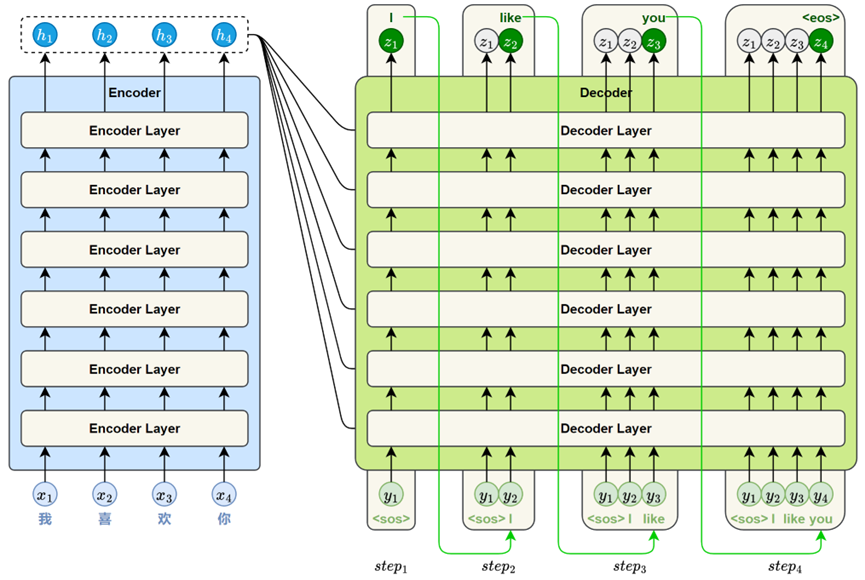

### 编码器
* Transformer的编码器用于理解输入序列的语义信息，并生成每个token的上下文表示，为解码器生成目标序列提供基础，编码器由多个结构相同的编码器层堆叠而成。
* 每个编码层都是对输入序列进行上下文建模，使每个位置的表示都能融合来自整个序列的全局信息。每个编码层都包含两个子层——自注意力子层和前馈神经网络子层。
    * Self-Attention：用于捕捉序列中各位置之间的依赖关系
    * Feed-Forward：用于对每个位置的表示进行非线性变换，从而提升模型的表达能力
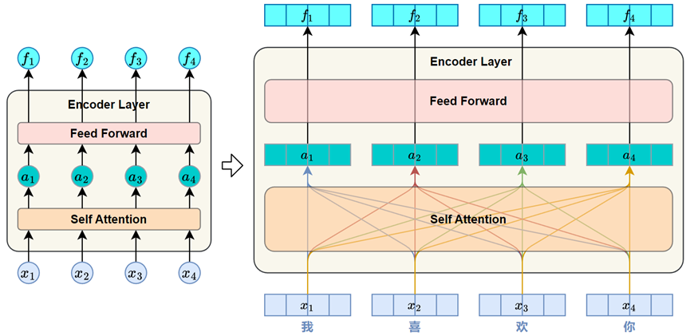

#### 自注意力层
* 自注意力机制（Self-Attention）是Transformer编码器的核心结构之一，用于在序列内部建立各位置之间的依赖关系，使模型能够为每个位置生成融合全局信息的表示。
* 被称为“自”注意力，是因为模型在计算每个位置的表示时，参考的信息全部来自同一个输入序列本身，而不是来自另一个序列（传统的Seq2Seq注意力机制）

1. 自注意力计算过程
    1. 生成Query、Key、Value向量  
    自注意机制的第一步，是将输入序列的每个位置表示映射为三个不同的向量，分别是查询（Q）、键（K）和值（V）。  
    Query：表示当前词的用于发起注意力匹配的向量  
    Key：表示序列中每个位置的内容标识，用于与Query进行匹配  
    Value：表示该位置携带的信息，用于加权汇总得到新的表示  
    自注意力的核心思想是：每个位置用自身的Query向量，与整个序列中所有位置的Key向量进行相关性计算，从而得到注意力权重，并据此对对应的Value向量加权汇总，形成新的表示  
    $$
    \begin{aligned}
    Q &= X \cdot W_q \\
    K &= X \cdot W_k \\
    V &= X \cdot W_v
    \end{aligned}
    $$
    2. 计算位置间相关性  
    完成Q、K、V向量的计算后，模型使用每个位置的Q向量与所有位置（包括自己）的K向量进行相关性评分，评分函数采用向量点积形式，由于高维空间中点积数值可能过大影响softmax稳定性，实际计算对结果进行了缩放，最终的评价函数（其中$d_k$是K向量的维度，用于缩放点积的幅度，评分值越高表示第$i$个位置越关注第$j$个位置的信息）：  
    $$
    score(i,j) = \frac{q_i \cdot k_j}{\sqrt{d_k}}
    $$
    * 对于整个序列，可以通过矩阵运算一次性计算所有位置之间的评分
    3. 计算注意权重  
    得到每个位置与所有位置之间的相关性评分后，使用softmax进行归一化，确保每个位置对所有位置的关注程度之和为1，形成一个有效的加权分布
    $$
    \begin{aligned}
    w_{11} \ w_{12} \ w_{13} \ w_{14} &= \mathrm{softmax}\left( s_{11} \ s_{12} \ s_{13} \ s_{14} \right) \\
    w_{21} \ w_{22} \ w_{23} \ w_{24} &= \mathrm{softmax}\left( s_{21} \ s_{22} \ s_{23} \ s_{24} \right) \\
    w_{31} \ w_{32} \ w_{33} \ w_{34} &= \mathrm{softmax}\left( s_{31} \ s_{32} \ s_{33} \ s_{34} \right) \\
    w_{41} \ w_{42} \ w_{43} \ w_{44} &= \mathrm{softmax}\left( s_{41} \ s_{42} \ s_{43} \ s_{44} \right)
    \end{aligned}
    $$
    4. 加权汇总生成输出
    根据注意力权重对所有位置的V向量进行加权求和，得到每个位置融合全局信息后的新表示
    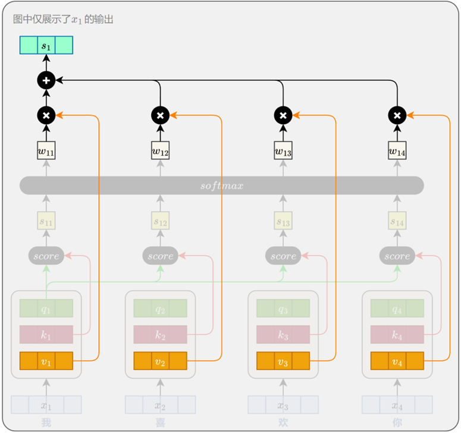
    - 对于整个序列，同样可以通过矩阵运算一次性计算所有位置的输出

    综上所述，可得整个注意力机制的完整计算公式如下：
    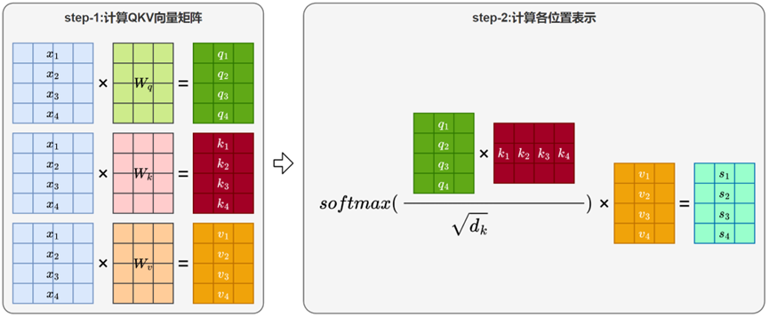
    对应[原始论文](https://arxiv.org/pdf/1706.03762)中的：
    $$
    \mathrm{Attention}(Q, K, V) = \mathrm{softmax}\left( \frac{QK^T}{\sqrt{d_k}} \right) V
    $$

2. 多头注意力计算过程  
Transformer引入多头注意力机制（Multi-Head Attention），核心思想是通过多组独立的Q、K、V投影，让不同注意力头分别专注于不同的语义关系，最后将各头的输出拼接融合。
- 多头注意力的计算过程如下：
    1. 分别计算各头注意力
    2. 合并多头注意力  
    多个输出矩阵按维度拼接，再乘以$W_o$（用一个矩阵做变换，最后的输出需要和自注意力层的输入维度保持一致，因为后面还需要做残差连接）得到最终多头注意力的输出
    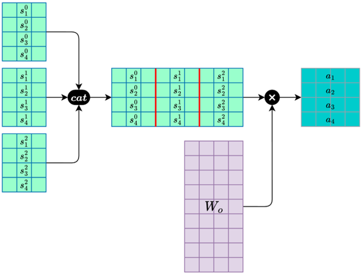

#### 前馈神经网络层
- 前馈神经网络（Feed-Forwar Network, FFN）是Transformer编码器中每个子层的重要组成部分，接在多头注意力子层后。通过对每个位置的表示进行逐位置、非线性的特征变换，进一步提升模型对复杂语义的建模能力 
- 一个标准的FFN子层包含两个线性变换和一个非线性激活函数，中间通常使用 ReLU激活，其计算公式如下：
$$
\mathrm{FFN}(x) = \mathrm{Linear}_2\left( \mathrm{ReLU}\left( \mathrm{Linear}_1(x) \right) \right) = W_2 \cdot \mathrm{ReLU}(W_1 x + b_1) + b_2
$$
 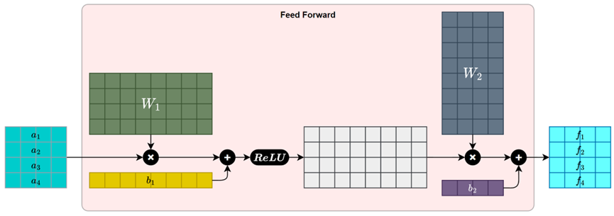
- 同理，FFN的输入和输出维度也需要保持一致，目的是后续需要做残差连接

#### 残差连接与层归一化
Transformer每个编码器层中，每个子层包括自注意力子层和前馈神经网络子层，其输出都需要经过残差链接（Residual Connection）和层归一化（Layer Normalization）处理。用于缓解模型训练中的梯度消失、收敛困难等问题，对于Transformer能够堆叠多层至关重要。
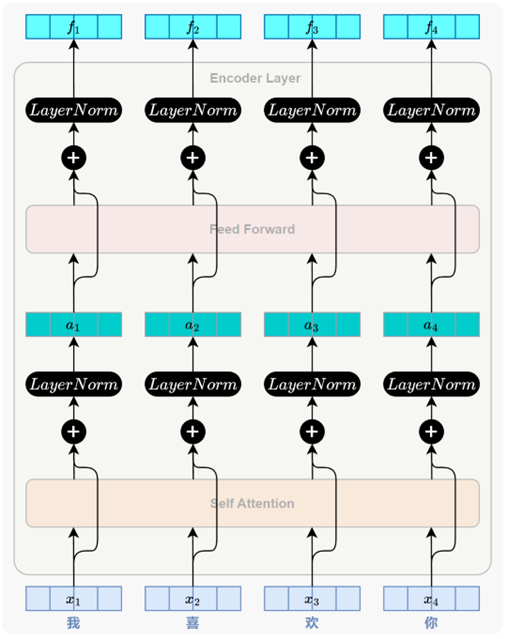
- 残差连接（跳跃连接或捷径连接），用于缓解深层神经网络中的梯度消失问题。核心思想是将子层的输入直接与其输出相加，形成一条跨越子层的捷径。残差连接确保反向传播时，梯度至少有一条稳定通路可回传，是深层网络可稳定训练的关键结构。
- 层归一化（Layer Normalization），作用是规范输入序列中每个token的特征分布（某个token的表示可能在不同维度上有较大数值差异），提升模型训练的稳定性。
    - 均值计算
    - 标准差计算（分母加一个小的常数，防止出现除以0的情况）
    - 缩放和平移（在学习归一化的基础上进行适当的调整，保证归一化不会限制模型的表示）

#### 位置编码
为了捕捉词语之间的顺序，引入一个关键机制——位置编码（Positional Encoding），为每一个词引入一个表示其位置信息的向量，并将其与对应的词向量相加，作为模型输入的一部分。这样模型既能获取词义信息，也能感知其在句子中的位置，从而具备对基本语序的理解能力。
- 绝对位置编号，越靠后的token位置编码就越大，直接与 词向量相加会造成数值倾斜，让模型更关注位置忽略词义。
- 位置编码归一化为[0, 1]区间，相同位置的词在不同长度句子中的位置编码不一致
- 基于正弦（sin）和余弦（cos）函数的位置编码，其中$pos$是当前词在序列中的位置，$i$用于表示位置编码向量的维度索引（$2i$表示偶数维，$2i+1$表示奇数维），$d_{model}$是词向量的维度大小。这种编码方式不依赖任何可学习参数，数值稳定且具有以下优势：
- 所有值都在[-1, 1]范围内，数值稳定
- 编码方式固定、可预计算，无需训练
- 相同位置的编码在不同句子中保持一致
- 编码之间具有数学规律，便于模型在注意力机制中感知语句之间的相对位置关系
$$
\begin{aligned}
PE_{(pos, 2i)} &= \sin\left( \frac{pos}{10000^{\frac{2i}{d_{model}}}} \right) \\
PE_{(pos, 2i+1)} &= \cos\left( \frac{pos}{10000^{\frac{2i}{d_{model}}}} \right)
\end{aligned}
$$

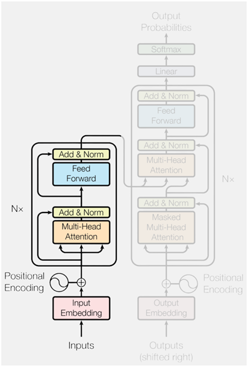

### 解码器
根据编码器的输出，逐步生成目标序列中的每一个词。生成方式采用自回归机制（autogressive）：每一步的输入由此前已经生成的所有词组成，模型将输出一个与当前长度相同的序列表示，只取最后一个位置的输出作为当前步的预测记过，直到生成结束标记。
- 每个Decoder Layer都包含三个子层，分别是Masked自注意力子层、编码器-解码器注意力子层和前馈神经网络子层
- Masked自注意力子层，用于建模当前位置与前文词之间的依赖关系，为了在训练时模拟逐词生成的过程，引入遮盖机制（Mask），限制每个位置只能关注它前面的词
- 编码器-解码器注意力子层，建模当前解码位置与源序列各位置之间的依赖关系。通过注意力机制，模型能根据当前状态从编码器的输出中提取相关上下文信息（相当于Seq2Sqe模型中的Attention机制）
- 前馈神经网络子层，对每个位置的表示进行非线性变换，增强模型的表达能力
- 每个子层后配有残差连接与层归一化，结构设计与编码器保持一致，确保训练的稳定性和效率
- 解码器输入端同样需要位置编码，用于提供序列中的位置信息，计算方式与编码器相同
- 输出端解码器的隐藏向量会送入线性变换层，映射为词表大小的向量，通过softmax生成一个概率分布，用于预测当前应输出的词

#### Masked 自注意力子层
- Transformer 编解码器都具有一个典型特性：输入多少个词，就输出多少个表示。在推理阶段，只使用解码器最后一个位置的输出作为当前步的预测结果。如果训练阶段也完全按照推理流程进行，就必须将每个目标序列拆分成多个训练样本，每个样本输入一段前文，只预测一个词。训练效率极低，完全无法利用 Transformer 并行计算的优势。
- Transformer 采用了并行训练策略：一次性输入完整目标序列，同时预测每个位置的词。但如果不加限制，这种方式会让模型在训练每个位置时“看到”后面的词，即提前访问未来信息，破坏生成任务的因果结构。
- 解码器在自注意力机制中引入了遮盖机制（Mask）。该机制会在计算注意力时，阻止模型访问当前位置之后的词，只允许它依赖自身及前文的信息。这样，即使在并行训练时，模型也只能像逐词生成一样“看见”它应该看到的内容，从而保持训练与推理阶段的一致性。
- Mask 机制的实现非常简单：只需将注意力得分矩阵中当前位置对其后续位置的评分设置为 $−∞$，这样，在经过 softmax 运算后，这些位置的权重会趋近于 $0$。最终在加权求和时，来自未来位置的信息几乎不会参与计算，从而实现了“当前词只能看到它前面的词”的约束。

#### 编码器-解码器注意力子层
- Query 来自解码器当前的输入表示，即当前生成状态
- Key 和 Value 来自编码器的输出表示，即整个源序列的上下文
- 当前生成位置使用自己的Query，去“询问”编码器输出中的哪些位置最相关。注意力机制会根据 Query 与所有 Key 的相似度，为每个源位置分配一个权重，然后用这些权重对 Value 进行加权求和，得到当前生成词所需的上下文信息。

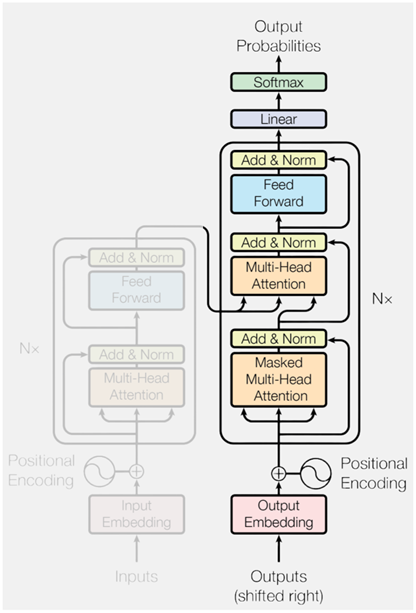

### 模型训练与推理机制
Tranformer训练和推理都基于自回归机制：模型逐步生成目标序列中的每个词，但是在训练与推理存在明显区别
#### 模型训练
- 训练时，Transformer将目标序列整体输入解码器，并在每个位置同时进行预测，解码器在自注意力子层中引入遮盖机制（Mask），限制每个位置只能关注它前面的词。
- 这种机制让模型在结构上模拟逐词生成，在实现上能充分并行计算，大幅提升训练效率
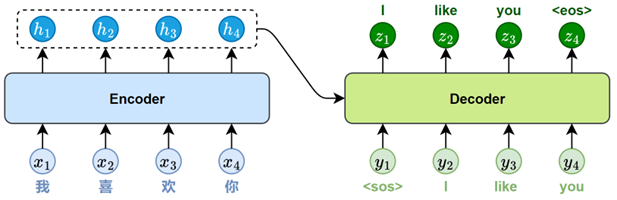
#### 模型推理
- 推理时，每一步都要重新输入整个已生成序列，模型基于全量前文重新计算注意力分布，决定下一个词的输出，整个过程必须顺序执行，无法并行

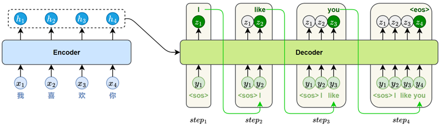
