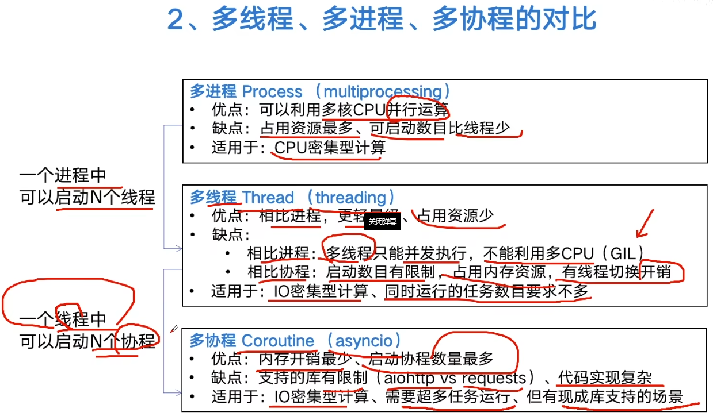
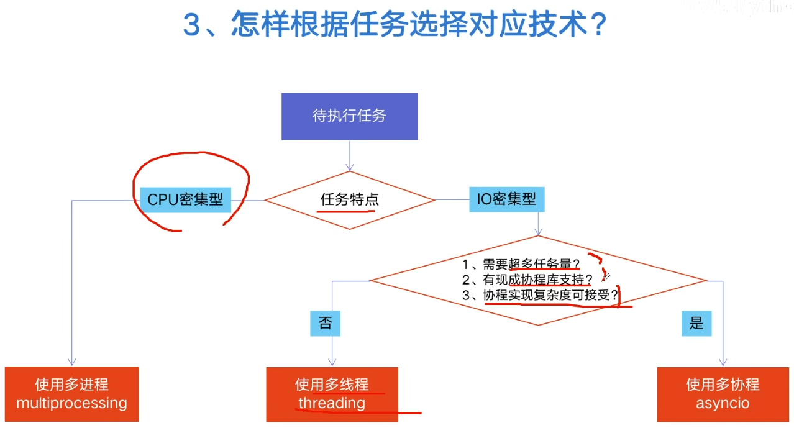
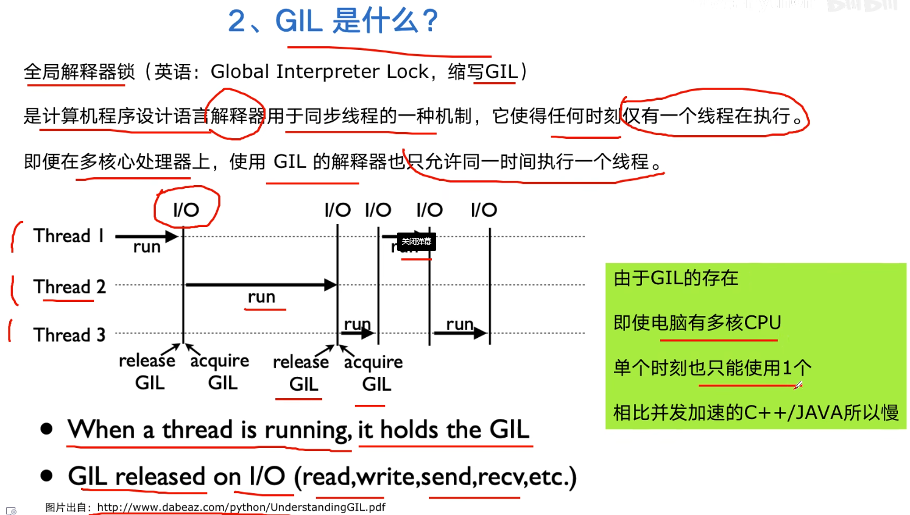
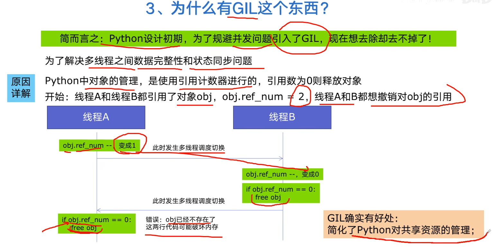
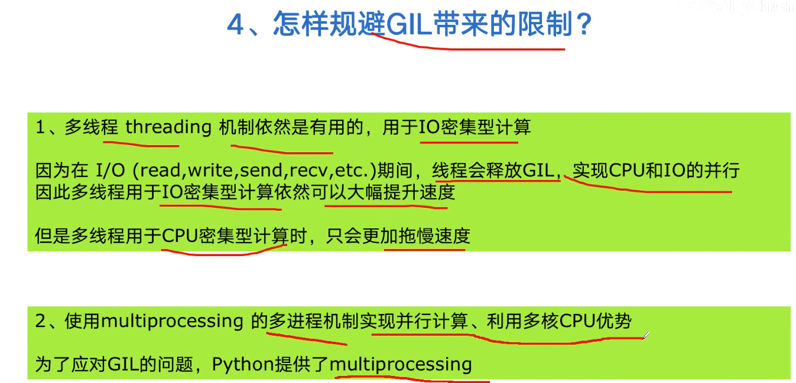
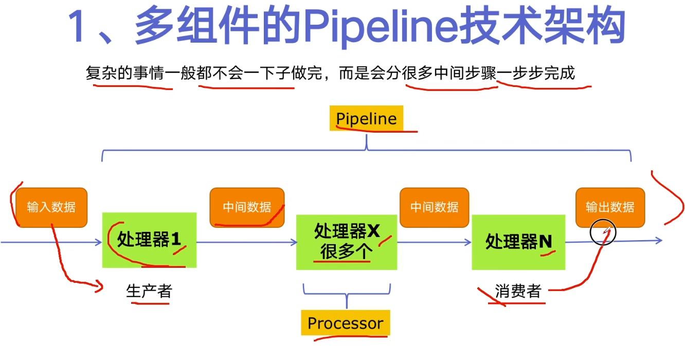
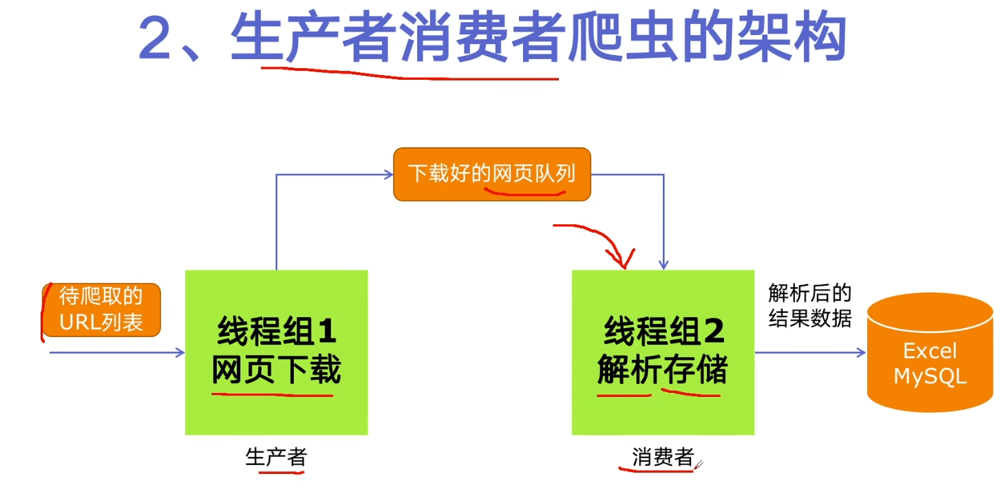

# Python基础
## 魔法方法（[学习视频地址](https://www.bilibili.com/video/BV1b84y1e7hG?spm_id_from=333.788.videopod.sections&vd_source=d3285a2ba86bc368a3901aac90d388ea)）
* `__new__`: 从class建立一个object的过程;
    例如想要做一个singleton class（单例类），在建立一个class的object之前，判断一下有没有其他object已经被建立；还有需要用到metaclass有关的内容也会用到new；new有返回值，返回这个object；
* `__init__`: 有object之后给object初始化的过程;
    初始化使用 init；init没有返回值；
* `__del__`: 可以理解为析构函数，但不是析构函数;
    当对象被释放的时候需要干什么; `__del__`和python里面的关键字del没有关系，使用关键字del对象并不一定会触发`__del__`，del对象只是让这个对象少一个引用；只有当对象完全被释放的时候才会触发`__del__`
* `__repr__`: 返回object的字符串表示;
    返回更详细的信息，给开发者用的；需要显示调用(repr(obj))；`__repr__`找不到不会去找`__str__`;
* `__str__`:返回object的字符串表示;
    返回人类更容易理解的string，注重可读性；打印对象/字符串时被调用;`__str__`找不到会自动去找`__repr__`;
* `__format__`: 使用某种格式打印object；
    当使用 `f"{obj:格式}"` 或者
    ```
    "{}".format(obj)
    "{:格式}".format(obj)
    format(obj, "格式")
    ```
    的时候会被调用，如果找不到会去找`__str__`
* `__bytes__`：客制化object的bytes表示;
    bytes(obj)显示调用
### rich comparison
* `__eq__`：使用"=="的时候被调用，如果不写__eq__方法，使用"=="的时候，其实是使用"is"在判断;
* `__ne__`：使用"!="的时候被调用，如果不写__ne__方法，使用"!="的时候，其实是使用"is"取反的逻辑;
* `__gt__`：使用">"的时候被调用，"<"逻辑直接取反（__ge__同理）;
* `__lt__`：使用"<"的时候被调用，对于这类rich comparison的函数（要比较x和y的大小，如果y是x的衍生类，则优先使用y的rich comparison，否则优先使用x的rich comparison）（__le__同理，但是python不会推理，不会认为小于等于就是小于或者等于，即 x <= y  不等价于 x < y or x == y）;
* `__hash__`：python会对自定义类默认__eq__和__hash__，但是如果对自定义类定义了自己的__eq__函数，默认的__hash__函数就会被删掉，__hash__的基本定义在于如果两个东西相等，hash值必须相等。__hash__的要求是必须返回一个整数，对于两个相等的对象，必须要有同样的hash值
* `__bool__`：当自定义对象放在条件判断语句中是，默认都是true，只有当自定义了__bool__方法，自定义对象放在条件判断语句中时会被调用;
* `__getattr__`：读取一个对象不存在的属性的时候才会被调用;
* `__getattribute__`：只要尝试读取对象的属性，都会被调用，该方法非常容易产生无限递归。default behavior是super().getattribute（或者是object().setattr）;
* `__setattr__`：尝试去写一个属性的时候，就会被调用;同样是，使用super().__setattr__来完成默认行为（或者使用object.__setattr__来完成）
* `__delattr__`：尝试删除一个object的属性的时候被调用;
* `__dir__`：调用dir(object)的时候被调用，必须返回一个sequence;
* `__slots__`：不是一个魔术方法，__slots__ = ['a', 'b']表示这个class的object里面可以有哪些自定义的attribute，这里表示只能有属性a和b（白名单机制）;
### emulation
#### 运算
python的类型系统是duck type，不检查对象是什么类型，而是检查对象有没有相应的功能；
* `__add__`、`__sub__`、`__mul__`、`__matmul__`（矩阵乘法）、`__truediv__`（除法）、`__floordiv__`（整除）、`__mod__`、`__divmod__`（既拿到商也拿到余数）、`_pow__`、`__lshift__`（左移）、`__rshift__`（右移）、`__and__`、`__xor__`、`__or__`、`__add__`;上述所有和数的计算的方法都有r版本，即按右边的进行计算（例如__rmul__），所有和数的计算的方法都有in place版本，即修改self并返回，类似+=（例如__iadd__）;
* 一元运算`__neg__`（-）和`__pos__`（+），一元操作`__abs__``和__invert__`(位运算~)
* comversion魔术方法`__complex__`、`__int__`、`__float__`，这三个方法返回的值必须是对应的数据结构；
* `__index__`，把数据结构当场index的使用的时候等价于什么
* `__round__`（四舍五入）、`__trunc__`（小数点后面不要）、`__floor__`（向下取整）、`__ceil__`（向上取整）
#### 模拟
* `__call__`让类的实例对象，可以像普通函数一样直接加括号调用。nn.Module内置实现，在内部执行钩子函数调用forward，子类里面重写forward方法即可；
* `__len__`（如果object没有定义__bool__方法，将其作为一个条件进行判断的时候，如果长度是0则为false）让类支持Python原生len()函数，数据集Dataset必须实现该方法；
* `__getitem__`让类支持下标索引访问（像列表、字典一样）、`__setitem__`（索引赋值）、`__delitem__`
* `__reversed__`、`__contains__`、`__iter__`、`__missing__`（只有在dict的subclass里才有用，在一个字典里面找一个key但是找不到的时候应该怎么做）
* context type，想要自定义一个context就需要自定义`__enter__`和`__exit__`，使用with object来调用

## 装饰器[([学习视频地址](https://www.bilibili.com/video/BV1U2WmzfEqp?spm_id_from=333.788.videopod.episodes&vd_source=a8c626e199c49c935b1d5a6550f2151f&p=55))
装饰器的作用是不改变原有函数的基础上，给原有函数增加额外功能（装饰器本质上是一个闭包）
* 闭包是携带外部变量的内层函数，外层函数定义一个环境变量，内层函数引用这个变量，外层函数返回内层函数本身；
* 闭包的三个条件：函数嵌套、内层函数引用外层函数的非全局变量、外层函数返回内层函数对象；

## 迭代器和生成器([学习视频地址](https://www.bilibili.com/video/BV1U2WmzfEqp?spm_id_from=333.788.videopod.episodes&vd_source=a8c626e199c49c935b1d5a6550f2151f&p=98))
* 可迭代对象（例如列表、字典等）实现了__iter__方法;
* 迭代器（惰性计算）实现了__iter__（返回迭代器对象本身self）和__next__（返回下一个数据）两个方法
* 生成器(简化版的迭代器，不需要手动写__iter__和__next__方法，惰性计算，按需生成节省内存)，推导式（没有元组推导式概念，本质是生成器）或者yield关键字实现

## 深拷贝和浅拷贝（[学习视频地址](https://www.bilibili.com/video/BV1U2WmzfEqp?spm_id_from=333.788.videopod.episodes&vd_source=a8c626e199c49c935b1d5a6550f2151f&p=66)）
* 深浅拷贝分别指的是 copy模块的copy()（浅拷贝），copy模块的deepcopy()函数（深拷贝）;
* 深拷贝拷贝的多，浅拷贝拷贝的少；
* 深浅拷贝主要针对可变类型来讲，深拷贝拷贝所有的（可变的）层，浅拷贝只拷贝第一层（可变），如果针对不可变类型，则深浅拷贝用法和普通赋值一样，并无区别;

## Python 并发编程
引入并发编程，就是为了提升程序运行速度（多线程并发threading、多CPU并行multiprocessing、多机器运行）
* 多线程：threading，利用CPU和IO可以同时执行的原理，让CPU不会等待完成
* 多进程：multiprocessing，利用多核CPU的能力，真正的并行执行任务
* 异步IO：asyncio，在单线程利用CPU和IO同时执行的原理，实现函数异步执行
<br><br>
* 使用Lock对资源加锁，防止冲突访问
* 使用Queue实现不同线程/进程之间的数据通信，实现生产者-消费者模式
* 使用线程池Pool/进程池Pool，简化线程/进程的任务提交、等待结束、获取结果
* 使用subprocess启动外部程序的进程，并进行输入输出交互

### 怎样选择多线程(Thread)、多进程(Process)和多协程(Coroutine)
CPU密集型（CPU-bound）  
IO密集型（I/O-bound）

### 多线程、多进程、多协程的对比



### Python速度慢的罪魁祸首，全局解释器锁GIL
1. Python速度慢的两大原因
* 动态类型语言，边解释边执行
* GIL，无法利用多核CPU并发执行




### 使用多线程，Python爬虫被加速10倍
Python创建多线程的方法
```
1. 准备一个函数
def my_func(a, b):
    do_craw(a, b)

2. 怎样创建一个线程
import threading
t = threading.Thread(target=my_func, args=(100, 200))

3. 启动线程
t.start()

4. 等待结束
t.join()
```

### Python实现生产者消费者爬虫


3. 多线程数据通信的 queue.Queue
queue.Queue可以用于多线程之间的、线程安全的数据通信
```
1. 导入类库
import queue

2。创建Queue
q = queue.Queue()

3. 添加元素
q.put(item)

4. 获取元素
itemp = q.get()

5. 查询状态
# 查看元素的多少
q.qsize()
# 判断是否为空
q.empty()
# 判断是否已满
q.full()
```

### Python线程安全以及解决方案
1. 线程安全概念介绍  
线程安全指某个函数、函数库在多线程环境中被调用时，能够正确地处理多个线程之间的共享变量，使程序功能能正确完成。由于线程的执行随时会发生切换，就造成了不可预料的结果，出现了线程不安全(GIL是同一时间只能执行一个python，同一时间可以多个线程访问共享资源）

2. Lock用于解决线程安全问题  
用法1：try-finally模式
```
import threading

lock = threading.Lock()

lock.acquire()
try:
    # do something
finally:
    lock.release()
```

用法2：with模式
```
import threading

lock = threading.Lock()

with lock:
    # do something
```