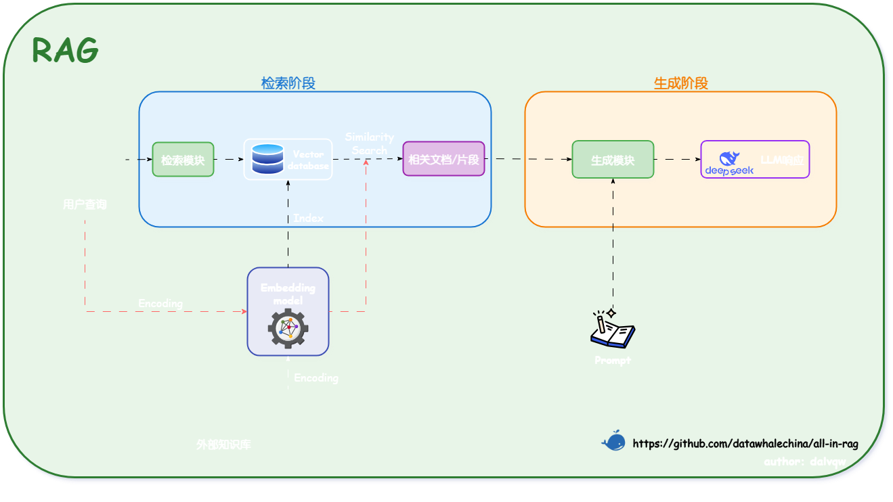
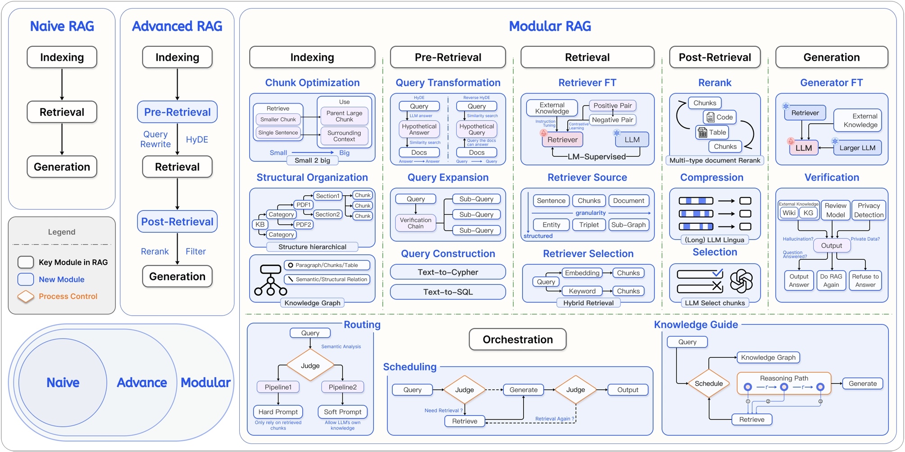
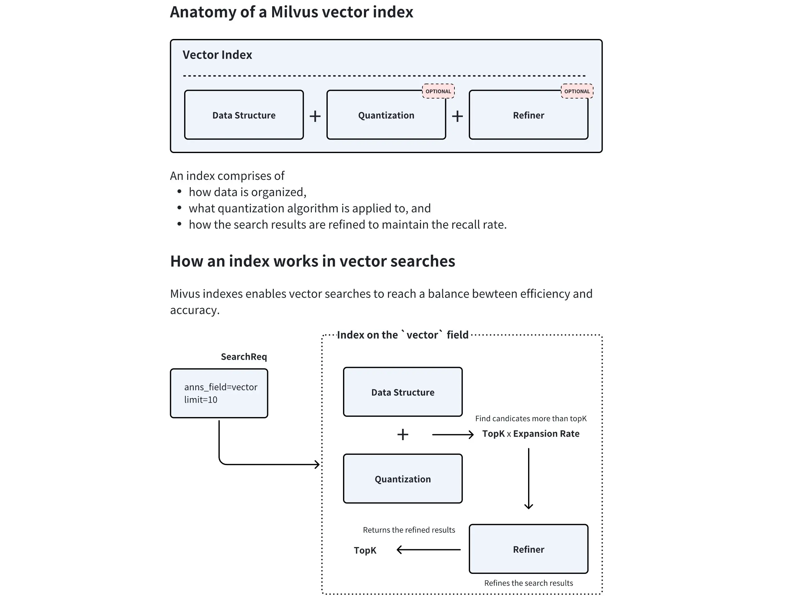

# RAG与Agent

项目学习地址
- [happy-llm](https://github.com/datawhalechina/happy-llm)
- [all-in-rag](https://datawhalechina.github.io/all-in-rag/#/chapter1/01_RAG_intro)

## RAG
核心定义：从本质上讲，RAG（Retrieval-Augmented Generation）是一种旨在解决大语言模型（LLM）“知其然不知其所以然”问题的技术范式。它的核心是将模型内部学到的“参数化知识”（模型权重中固化的、模糊的“记忆”），与来自外部知识库的“非参数化知识”（精准、可随时更新的外部数据）相结合。其运作逻辑就是在 LLM 生成文本前，先通过检索机制从外部知识库中动态获取相关信息，并将这些“参考资料”融入生成过程，从而提升输出的准确性和时效性。  

技术原理：  
（1）检索阶段：寻找“非参数化知识”
- 知识向量化：嵌入模型（Embedding Model） 充当了“连接器”的角色。它将外部知识库编码为向量索引（Index），存入向量数据库。
- 语义召回：当用户发起查询时，检索模块利用同样的嵌入模型将问题向量化，并通过相似度搜索（Similarity Search），从海量数据中精准锁定与问题最相关的文档片段。  
（2）生成阶段：融合两种知识
- 上下文整合：生成模块接收检索阶段送来的相关文档片段以及用户的原始问题。
- 指令引导生成：该模块会遵循预设的 Prompt 指令，将上下文与问题有效整合，并引导 LLM（如 DeepSeek）进行可控的、有理有据的文本生成。

RAG技术演进分类

|          | 初级 RAG（Naive RAG）                     | 高级 RAG（Advanced RAG）                                  | 模块化 RAG（Modular RAG）                                                                 |
| :------- | :---------------------------------------- | :-------------------------------------------------------- | :--------------------------------------------------------------------------------------- |
| 流程     | 离线: 索引 在线: 检索 → 生成          | 离线: 索引 在线: … → 检索前 → … → 检索后 → …           | 积木式可编排流程                                                                         |
| 特点     | 基础线性流程                              | 增加检索前后的优化步骤                                    | 模块化、可组合、可动态调整                                                               |
| 关键技术 | 基础向量检索                              | 查询重写（Query Rewrite） 结果重排（Rerank）           | 动态路由（Routing） 查询转换（Query Transformation） 多路融合（Fusion）            |
| 局限性   | 效果不稳定，难以优化                      | 流程相对固定，优化点有限                                  | 系统复杂性高                                                                             |

### 数据准备
#### 数据加载
- 文档加载器负责将各种格式的非结构化文档（如PDF、Word、Markdown、HTML等）转换为程序可以处理的结构化数据。数据加载的质量会直接影响后续的索引构建、检索效果和最终的生成质量。  
- 文档加载器在 RAG 的数据管道中一般需要完成三个核心任务，一是解析不同格式的原始文档，将 PDF、Word、Markdown 等内容提取为可处理的纯文本，二是在解析过程中同时抽取文档来源、页码、作者等关键信息作为元数据，三是把文本和元数据整理成统一的数据结构，方便后续进行切分、向量化和入库，其整体流程与传统数据工程中的抽取、转换、加载相似，目标都是把杂乱的原始文档清洗并对齐为适合检索和建模的标准化语料。  

| 工具名称        | 特点                               | 适用场景               | 性能表现                     |
| :-------------- | :--------------------------------- | :--------------------- | :--------------------------- |
| PyMuPDF4LLM     | PDF→Markdown转换，OCR+表格识别     | 科研文献、技术手册     | 开源免费，GPU加速            |
| TextLoader      | 基础文本文件加载                   | 纯文本处理             | 轻量高效                     |
| DirectoryLoader | 批量目录文件处理                   | 混合格式文档库         | 支持多格式扩展               |
| Unstructured    | 多格式文档解析                     | PDF、Word、HTML等      | 统一接口，智能解析           |
| FireCrawlLoader | 网页内容抓取                       | 在线文档、新闻         | 实时内容获取                 |
| LlamaParse      | 深度PDF结构解析                    | 法律合同、学术论文     | 解析精度高，商业API          |
| Docling         | 模块化企业级解析                   | 企业合同、报告         | IBM生态兼容                  |
| Marker          | PDF→Markdown，GPU加速              | 科研文献、书籍         | 专注PDF转换                  |
| MinerU          | 多模态集成解析                     | 学术文献、财务报表     | 集成LayoutLMv3+YOLOv8        |

#### 文本分块
- 文本分块（Text Chunking）是构建 RAG 流程的关键步骤。它的原理是将加载后的长篇文档，切分成更小、更易于处理的单元。这些被切分出的文本块，是后续向量检索和模型处理的基本单位。
- 文本分块是为了满足模型上下文限制，Embedding Model和LLM都有上下文窗口限制
- 块不是越大越好。嵌入过程中的信息损失，Lost in the Middle，主题稀释导致检索失败等问题

#### 基础分块策略
1. 固定大小分块
2. 递归字符分块，遇到超长段落会继续使用更细粒度的分隔符（句子→单词→字符）直到满足大小要求
3. 语义分块，语义主题发生显著变化的地方进行切分
4. 基于文档结构的分块，于具有明确结构标记的文档格式（如Markdown、HTML、LaTex），可以利用这些标记来实现更智能、更符合逻辑的分割。

### 索引构建
#### 向量嵌入
现代嵌入模型的核心通常是 Transformer 的编码器（Encoder）部分，BERT 就是其中的典型代表。它通过堆叠多个 Transformer Encoder 层来构建一个深度的双向表示学习网络。  

##### 嵌入模型训练原理
主要训练任务：BERT的成功很大程度上归功于 自监督学习 策略，它允许模型从海量的、无标注的文本数据中学习知识。  
- 任务一：掩码语言模型 (Masked Language Model, MLM)。随机地将输入句子中 15% 的词元（Token）替换为一个特殊的 [MASK] 标记，让模型去预测这些被遮盖住的原始词元是什么。通过这个任务，模型被迫学习每个词元与其上下文之间的关系，从而掌握深层次的语境语义。
- 任务二：下一句预测 (Next Sentence Prediction, NSP)。构造训练样本，每个样本包含两个句子 A 和 B。其中 50% 的样本，B 是 A 的真实下一句（IsNext）；另外 50% 的样本，B 是从语料库中随机抽取的句子（NotNext）。让模型判断 B 是否是 A 的下一句。
这个任务让模型学习句子与句子之间的逻辑关系、连贯性和主题相关性。（后续研究表明NSP任务过于简单会损害性能，许多现代预训练模型在预训练阶段移除了NSP）。

虽然 MLM 和 NSP 赋予了模型强大的基础语义理解能力，但为了在检索任务中表现更佳，现代嵌入模型通常会引入更具针对性的训练策略。
- 度量学习 (Metric Learning) ：直接以“相似度”作为优化目标。收集大量相关的文本对（例如，（问题，答案）、（新闻标题，正文））。训练的目标是优化向量空间中的相对距离：让“正例对”的向量表示在空间中被“拉近”，而“负例对”的向量表示被“推远”。关键在于优化排序关系，而非追求绝对的相似度值（如 1 或 0），因为过度追求极端值可能导致模型过拟合。
- 对比学习 (Contrastive Learning) ：在向量空间中，将相似的样本“拉近”，将不相似的样本“推远”。构建一个三元组（Anchor, Positive, Negative）。其中，Anchor 和 Positive 是相关的（例如，同一个问题的两种不同问法），Anchor 和 Negative 是不相关的。训练的目标是让 distance(Anchor, Positive) 尽可能小，同时让 distance(Anchor, Negative) 尽可能大。

#### 多模态嵌入
多模态嵌入 (Multimodal Embedding) 的目标正是为了打破这堵模态墙。其目的是将不同类型的数据（如图像和文本）映射到同一个共享的向量空间。在这个统一的空间里，一段描述“一只奔跑的狗”的文字，其向量会非常接近一张真实小狗奔跑的图片向量。

- CLIP模型采用**双编码器架构 (Dual-Encoder Architecture)**，包含一个图像编码器和一个文本编码器，分别将图像和文本映射到同一个共享的向量空间中。
- 为了让这两个编码器学会“对齐”不同模态的语义，CLIP 在训练时采用了对比学习 (Contrastive Learning) 策略。在处理一批图文数据时，模型的目标是：最大化正确图文对的向量相似度，同时最小化所有错误配对的相似度。通过这种“拉近正例，推远负例”的方式，模型从海量数据中学会了将语义相关的图像和文本在向量空间中拉近。这种大规模的对比学习赋予了 CLIP 有效的零样本（Zero-shot）识别能力。它能将一个传统的分类任务，转化为一个“图文检索”问题——例如，要判断一张图片是不是猫，只需计算图片向量与“a photo of a cat”文本向量的相似度即可。这使得 CLIP 无需针对特定任务进行微调，就能实现对视觉概念的泛化理解。

#### 向量数据库
| 维度           | 向量数据库                                     | 传统数据库 (RDBMS)                                       |
| :------------- | :--------------------------------------------- | :------------------------------------------------------- |
| 核心数据类型   | 高维向量 (Embeddings)                          | 结构化数据 (文本、数字、日期)                            |
| 查询方式       | 相似性搜索 (ANN)                               | 精确匹配                                                 |
| 索引机制       | HNSW, IVF, LSH 等 ANN 索引                    | B-Tree, Hash Index                                       |
| 主要应用场景   | AI 应用、RAG、推荐系统、图像/语音识别          | 业务系统 (ERP, CRM)、金融交易、数据报表                  |
| 数据规模       | 轻松应对千亿级向量                             | 通常在千万到亿级行数据，更大规模需复杂分库分表           |
| 性能特点       | 高维数据检索性能极高，计算密集型               | 结构化数据查询快，高维数据查询性能呈指数级下降           |
| 一致性         | 通常为最终一致性                               | 强一致性 (ACID 事务)                                     |

- 向量数据库通常采用四层架构，通过存储层、索引层、查询层和服务层的协同工作来实现高效相似性搜索，其中存储层负责存储向量数据和元数据，优化存储效率并支持分布式存储；索引层维护索引算法（HNSW、LSH、PQ等），负责索引的创建与优化，并支持索引调整；查询层处理查询请求，支持混合查询并实现查询优化；服务层管理客户端连接，提供监控和日志能力，并实现安全管理。
- 主要技术手段包括：
    - 基于树的方法：如 Annoy 使用的随机投影树，通过树形结构实现对数复杂度的搜索
    - 基于哈希的方法：如 LSH（局部敏感哈希），通过哈希函数将相似向量映射到同一“桶”
    - 基于图的方法：如 HNSW（分层可导航小世界图），通过多层邻近图结构实现快速搜索
    - 基于量化的方法：如 Faiss 的 IVF 和 PQ，通过聚类和量化压缩向量

#### Milvus实践
核心组件包括：
1. Collection（集合）  
    - Collection (集合): 相当于一个图书馆，是所有数据的顶层容器。一个 Collection 可以包含多个 Partition，每个 Partition 可以包含多个 Entity。Collection 是 Milvus 中最基本的数据组织单位，类似于关系型数据库中的一张**表 (Table)**。
    - Partition (分区): 相当于图书馆里的不同区域（如“小说区”、“科技区”），将数据物理隔离，让检索更高效。Partition 是 Collection 内部的一个逻辑划分。每个 Collection 在创建时都会有一个名为 _default 的默认分区
    - Schema (模式): 相当于图书馆的图书卡片规则，定义了每本书（数据）必须登记哪些信息（字段）。一个 Collection 由其 Schema 定义，在创建 Collection 之前，必须先定义它的 Schema。 Schema 规定了 Collection 的数据结构，定义了其中包含的所有字段 (Field) 及其属性。Schema通常包含以下几类字段：
        - 主键字段 (Primary Key Field): 每个 Collection 必须有且仅有一个主键字段，用于唯一标识每一条数据（实体）。它的值必须是唯一的，通常是整数或字符串类型。
        - 向量字段 (Vector Field): 用于存储核心的向量数据。一个 Collection 可以有一个或多个向量字段，以满足多模态等复杂场景的需求。
        - 标量字段 (Scalar Field): 用于存储除向量之外的元数据，如字符串、数字、布尔值、JSON 等。这些字段可以用于过滤查询，实现更精确的检索。

    - Entity (实体): 相当于一本具体的书，是数据本身。
    - Alias (别名): 相当于一个动态的推荐书单（如“本周精选”），它可以指向某个具体的 Collection，方便应用层调用，实现数据更新时的无缝切换。
2. 索引（Index）  
索引本身就是一种为了加速查询而设计的复杂数据结构。对向量数据创建索引后，Milvus 可以极大地提升向量相似性搜索的速度，代价是会占用额外的存储和内存资源。

- 数据结构：这是索引的骨架，定义了向量的组织方式（如 HNSW 中的图结构）。
- 量化(可选)：数据压缩技术，通过降低向量精度来减少内存占用和加速计算。
- 结果精炼(可选)：在找到初步候选集后，进行更精确的计算以优化最终结果。

Milvus 支持对标量字段和向量字段分别创建索引。
- 标量字段索引：主要用于加速元数据过滤，常用的有 INVERTED、BITMAP 等。通常使用推荐的索引类型即可。
- 向量字段索引：这是 Milvus 的核心。选择合适的向量索引是在查询性能、召回率和内存占用之间做出权衡的艺术。

##### 主要向量索引类型
- FLAT（精确查找）：暴力搜索，计算查询向量与集合中所有向量之间的实际距离
- IVF系列（倒排文件索引）：类似于书籍的目录。它首先通过聚类将所有向量分成多个“桶”(nlist)，查询时，先找到最相似的几个“桶”，然后只在这几个桶内进行精确搜索。
- HNSW（基于图的索引）：构建一个多层的邻近图。查询时从最上层的稀疏图开始，快速定位到目标区域，然后在下层的密集图中进行精确搜索。
- DiskANN（基于磁盘的索引）：一种为在 SSD 等高速磁盘上运行而优化的图索引。

| 场景 | 推荐索引 | 备注 |
| :--- | :--- | :--- |
| 数据可完全载入内存，追求低延迟 | HNSW | 内存占用较大，但查询性能和召回率都很优秀。 |
| 数据可完全载入内存，追求高吞吐 | IVF_FLAT / IVF_SQ8 | 性能和资源消耗的平衡之选。 |
| 数据量巨大，无法载入内存 | DiskANN | 在 SSD 上性能优异，专为海量数据设计。 |
| 追求 100% 准确率，数据量不大 | FLAT | 暴力搜索，确保结果最精确。 |

3. 检索  
- 基础向量检索（ANN Search）:
近似最近邻 (Approximate Nearest Neighbor, ANN) 检索，ANN 检索利用预先构建好的索引，能够极速地从海量数据中找到与查询向量最相似的 Top-K 个结果。  
    主要参数:
    - anns_field: 指定要在哪个向量字段上进行检索。
    - data: 传入一个或多个查询向量。
    - limit (或 top_k): 指定需要返回的最相似结果的数量。
    - search_params: 指定检索时使用的参数，例如距离计算方式 (metric_type) 和索引相关的查询参数。
- 增强检索
- 过滤检索(Filtered Search)：将向量相似性检索与标量字段过滤结合在一起。先根据提供的过滤表达式 (filter) 筛选出符合条件的实体，然后仅在这个子集内执行 ANN 检索。这极大地提高了查询的精准度。
- 范围检索 (Range Search)：有时我们关心的不是最相似的 Top-K 个结果，而是“所有与查询向量的相似度在特定范围内的结果”。范围检索允许定义一个距离（或相似度）的阈值范围。Milvus 会返回所有与查询向量的距离落在这个范围内的实体。
- 多向量混合检索 (Hybrid Search)：在一个请求中同时检索多个向量字段，并将结果智能地融合在一起。先进行并行检索，应用针对不同的向量字段（如一个用于文本语义的密集向量，一个用于关键词匹配的稀疏向量，一个用于图像内容的多模态向量）分别发起 ANN 检索请求。再进行结果融合，Milvus 使用一个重排策略（Reranker）将来自不同检索流的结果合并成一个统一的、更高质量的排序列表。常用的策略有 RRFRanker（平衡各方结果）和 WeightedRanker（可为特定字段结果加权）。
- 分组检索 (Grouping Search)：解决检索多样性不足的问题。分组检索允许指定一个字段（如 document_id）对结果进行分组。Milvus 会在检索后，确保返回的结果中每个组（每个 document_id）只出现一次（或指定的次数），且返回的是该组内与查询最相似的那个实体。

#### 索引优化
1. 上下文扩展  
- 在RAG系统中，常常面临一个权衡问题：使用小块文本进行检索可以获得更高的精确度，但小块文本缺乏足够的上下文，可能导致大语言模型（LLM）无法生成高质量的答案；而使用大块文本虽然上下文丰富，却容易引入噪音，降低检索的相关性。为了解决这一矛盾，LlamaIndex 提出了一种实用的索引策略——句子窗口检索（Sentence Window Retrieval）2。该技术巧妙地结合了两种方法的优点：它在检索时聚焦于高度精确的单个句子，在送入LLM生成答案前，又智能地将上下文扩展回一个更宽的“窗口”，从而同时保证检索的准确性和生成的质量。
- 句子窗口检索的核心思想：为检索精确性而索引小块，为上下文丰富性而检索大块。  

工作流程：  
（1）索引阶段：在构建索引时，文档被分割成单个句子。每个句子都作为一个独立的“节点（Node）”存入向量数据库。同时，每个句子节点都会在元数据（metadata）中存储其上下文窗口，即该句子原文中的前N个和后N个句子。这个窗口内的文本不会被索引，仅仅是作为元数据存储。  
（2）检索阶段：当用户发起查询时，系统会在所有单一句子节点上执行相似度搜索。因为句子是表达完整语义的最小单位，所以这种方式可以非常精确地定位到与用户问题最相关的核心信息。  
（3）后处理阶段：在检索到最相关的句子节点后，系统会使用一个名为 MetadataReplacementPostProcessor 的后处理模块。该模块会读取到检索到的句子节点的元数据，并用元数据中存储的完整上下文窗口来替换节点中原来的单一句子内容。  
（4）生成阶段：最后，这些被替换了内容的、包含丰富上下文的节点被传递给LLM，用于生成最终的答案。  

2. 结构化索引  
当一个查询可能只与其中一两个文档相关时，在整个文档库中进行无差别的向量搜索，不仅效率低下，还容易被不相关的文本块干扰，导致检索结果不精确。一个有效的方法是利用结构化索引。其原理是在索引文本块的同时，为其附加结构化的元数据（Metadata）。这些元数据可以是任何有助于筛选和定位信息的标签，例如文件名、文档创建日期、章节标题、作者、任何自定义的分类标签

### 检索优化
#### 混合检索（Hybrid Search）
混合检索（Hybrid Search）是一种结合了 稀疏向量（Sparse Vectors） 和 密集向量（Dense Vectors） 优势的先进搜索技术。旨在同时利用稀疏向量的关键词精确匹配能力和密集向量的语义理解能力，以克服单一向量检索的局限性，从而在各种搜索场景下提供更准确、更鲁棒的检索结果。  

- 稀疏向量，也常被称为“词法向量”，是基于词频统计的传统信息检索方法的数学表示。它通常是一个维度极高（与词汇表大小相当）但绝大多数元素为零的向量。它采用精准的“词袋”匹配模型，将文档视为一堆词的集合，不考虑其顺序和语法，其中向量的每一个维度都直接对应一个具体的词，非零值则代表该词在文档中的重要性（权重）。
- 密集向量，也常被称为“语义向量”，是通过深度学习模型学习到的数据（如文本、图像）的低维、稠密的浮点数表示。这些向量旨在将原始数据映射到一个连续的、充满意义的“语义空间”中来捕捉“语义”或“概念”。在理想的语义空间中，向量之间的距离和方向代表了它们所表示概念之间的关系。
- 混合检索通常并行执行两种检索算法，然后将两组异构的结果集融合成一个统一的排序列表。以下是两种主流的融合策略：
    - 倒数排序融合 (Reciprocal Rank Fusion, RRF)：RRF 不关心不同检索系统的原始得分，只关心每个文档在各自结果集中的排名。其思想是：一个文档在不同检索系统中的排名越靠前，它的最终得分就越高。其计分公式为：
    $$
    \text{RRF}_{\text{score}}(d) = \sum_{i=1}^{k} \frac{1}{\text{rank}_i(d) + c}
    $$
    其中：$d$ 是待评分的文档。$k$ 是检索系统的数量（这里是2，即稀疏和密集）。$\text{rank}_i(d)$ 是文档 $d$ 在第 $i$ 个检索系统中的排名。$c$ 是一个常数（通常设为60），用于降低排名靠前文档的相对权重，实现更稳健的排名融合。
    - 加权线性组合：这种方法需要先将不同检索系统的得分进行归一化（例如，统一到 0-1 区间），然后通过一个权重参数 α 来进行线性组合。
    $$
    \text{Hybrid}_{\text{score}} = \alpha \cdot \text{Dense}_{\text{score}} + (1 - \alpha) \cdot \text{Sparse}_{\text{score}}
    $$
    通过调整 α 的值，可以灵活地控制语义相似性与关键词匹配在最终排序中的贡献比例。

#### 查询构建

    