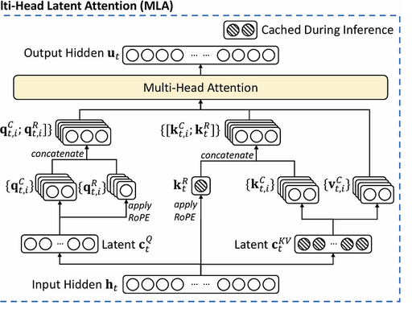

# Transformer 核心演进全解（2017-2025 主流方案）
从2017年原始Transformer到现在的主流大模型架构，核心演进完全围绕**「效果提升、显存优化、推理加速、长文本支持」**四大目标，分四大模块讲透，每个模块讲清「原始结构的痛点→演进方案→解决的问题→主流应用」，完全匹配Llama、Qwen等主流基座的架构设计。  
四个重要核心：
- KV Cache应用与推理阶段，因为训练阶段是Teacher Forcing，并行计算所有位置，无需缓存，推理时自回归生成，为了避免重复计算而进行缓存。
- KV Cache存在于自回归解码器以及编码器-解码器部分，纯编码器是一次性双向处理不需要重复使用。
- 加速 Q@K@V 的矩阵相乘，所有历史token的K和V一旦生成就不会改变，缓存以避免重复计算，Q 每一步是当前token的Q是新的，历史token的Q不再需要重复计算不用缓存。
- KV Cache会增加内存占用，用显存换速度策略。

## 模块一：注意力机制演进（MHA → KV Cache → MQA → GQA → MLA）
MHA、交叉注意力机制、稀疏注意力机制、层注意力、动态路由注意力、NAS优化注意力  
注意力机制是Transformer的核心，演进的核心目标是**降低推理显存占用、提升推理速度，同时最小化效果损失**。

### 1. 原始MHA（多头注意力，Multi-Head Attention）  
2017年，Transformer模型提出，论文标题《Attention Is All You Need》
原始Transformer的基础方案，核心逻辑：
- 把输入的特征分成`n`个独立的头，每个头独立计算Q（查询）、K（键）、V（值），每个头负责捕捉不同维度的语义信息；
- 每个头都有自己独立的K/V投影矩阵，n个头就有n组独立的K/V。

**核心痛点**：
- 自回归推理时，KV Cache显存占用极高。比如Llama 2 70B，8k上下文，单批次KV Cache就需要几十GB显存，是推理速度和长文本支持的最大瓶颈；
- 每个头都要存独立的K/V，参数量大，计算量高。

### 2. KV Cache（KV缓存）
**解决的核心问题**：自回归推理时的重复计算，大幅提升推理速度。
#### 原理：
大模型生成文本是一个字一个字吐的，每生成一个新字，都要把之前所有的字重新算一遍注意力，重复计算量极大。
KV Cache的逻辑是：
- 第一次计算时，把之前所有token的K和V都缓存下来；
- 生成新token时，只需要算新token的Q、K、V，再和缓存的历史K/V拼接计算，不用重复算历史token的K/V。

**效果**：推理速度提升10倍以上，是现在所有大模型推理的标配技术。

### 3. MQA（多查询注意力，Multi-Query Attention）
2019年，论文《Fast Transformer Decoding: One Write-Head is All You Need》
**解决的核心问题**：KV Cache显存占用过高的问题。
#### 原理：
- 保留多头的Q（每个头有独立的Q投影矩阵）；
- 所有头**共享同一组K/V投影矩阵**，也就是所有头用同一个K和V，不再每个头单独存。

**优缺点**：
- 优点：KV Cache显存占用直接降低到原来的1/n（n是头数），推理速度大幅提升；
- 缺点：共享K/V会损失少量模型效果，Google的PaLM、GPT-3.5最早采用。

### 4. GQA（分组查询注意力，Grouped-Query Attention）
2023年，LLaMA2,PaLM等，论文标题《GQA: Training Generalized Multi-Query Transformer Models from Multi-Head Checkpoints》
**解决的核心问题**：平衡MHA的效果和MQA的速度，是现在的工业界事实标准。
#### 原理：
- 把所有注意力头分成G个组；
- 每个组内共享同一组K/V投影矩阵，组与组之间的K/V独立。

比如Llama 3 8B用了8个KV头，32个Q头，也就是4个Q头共享一组K/V。

**核心优势**：
- 效果几乎和MHA持平，同时显存占用和推理速度接近MQA，完美平衡了效果和性能；
- 现在Llama 2/3、Qwen、DeepSeek、Mistral等几乎所有主流开源大模型，全部采用GQA作为默认注意力方案。

### 5. MLA(多头潜在注意力机制，Multi-head Latent Attention)
2024年，DeepSeek-V2,DeepSeek-V3，论文标题《DeepSeek-V2: A Strong, Economical, and Efficient Mixture-of-Experts Language Model》（DeepSeek-V2是MoE大语言模型）
- MLA本质上是将在“内存受限”（Memory-bound）阶段消耗的带宽成本，转移到了“计算受限”（Compute-bound）的新阶段，从而大幅降低了数据搬运的压力。
- MLA 核心思想：压缩 KV 到低维潜空间，推理时重构。受 LoRA 启发：不用存完整 K/V，存低秩压缩版。
- 核心实现步骤
    1. 下投影压缩（训练 + 推理全流程执行）
    将输入特征通过下投影矩阵，压缩到低维潜空间，生成用于缓存的潜向量：
    $$c_K=XW_{K}^D,\quad c_V=XW_{V}^D$$
    参数说明：  
    $X$：注意力层的输入特征，维度为`d_model`（模型维度，如 4096）   
    $W_{K}^D、W_{V}^D$：K/V 对应的下投影矩阵，维度为`d_model → d_latent`（如 4096→128）   
    $c_K、c_V$：压缩后的 K/V 潜向量，仅缓存这两个低维向量，显存占用大幅降低

    2. 上投影重构（仅推理时执行）
    计算注意力前，将缓存的低维潜向量通过上投影矩阵，动态恢复成全维度的 K/V 矩阵：
    $$K=c_K W_K^U,\quad V=c_V W_V^U$$
    参数说明：  
    $W_K^U、W_V^U$：K/V 对应的上投影矩阵，维度为`d_latent → d_model`（如 128→4096）  
    $K、V$：重构后的全维度 K/V 矩阵，用于后续注意力分数计算

    关键优化：RoPE 解耦设计

    旋转位置编码 RoPE 仅作用于查询向量 Q 和重构后的全维度 K 矩阵；  
    压缩阶段的潜向量$c_K、c_V$不携带 RoPE 位置信息，避免旋转变换的角度信息在低维压缩过程中被破坏，保证长文本位置建模的准确性。

---

## 模块二：前馈网络演进（FFN → GLU/SwiGLU → MoE）
前馈网络（FFN）是Transformer中负责特征变换的核心，占模型70%左右的参数量，演进的核心目标是**提升特征表达能力，同时控制计算量**。

### 1. 原始FFN
原始Transformer的FFN结构：`线性层 → ReLU激活 → 线性层`，公式：
$$FFN(x) = W_2 \cdot \text{ReLU}(W_1 \cdot x + b_1) + b_2$$
通常是先把特征维度扩大4倍，再压缩回原维度，用非线性激活提升表达能力。

**核心痛点**：ReLU激活的表达能力有限，特征过滤是固定的，无法动态调整信息的保留和过滤。

### 2. GLU（门控线性单元）→ SwiGLU（主流方案）
**解决的核心问题**：提升FFN的特征表达能力，让模型能动态过滤信息。
#### 原理：
GLU把输入分成两路，一路做线性变换，另一路经过门控激活函数，两路相乘得到输出，公式：
$$GLU(x) = (W_1 x) \odot \sigma(W_2 x)$$
- $\sigma$是sigmoid激活函数，作为门控，动态决定哪些信息可以通过；
- $\odot$是逐元素相乘。

#### 主流变体SwiGLU：
把sigmoid门控换成SiLU（Swish）激活，是现在的工业界标准：
$$SwiGLU(x) = (W_1 x) \odot \text{SiLU}(W_2 x)$$

**核心优势**：
- 门控机制让模型能动态调整信息的流通，特征表达能力远超原始FFN；
- 训练更稳定，效果更好，Llama、Qwen、GPT-NeoX等所有主流模型全部采用SwiGLU作为FFN的默认结构。

### 3. MoE（混合专家模型，Mixture of Experts）
**解决的核心问题**：打破「参数量越大，计算量越大」的魔咒，用更少的计算量实现更大的参数量和更好的效果。
#### 原理：
- 把原来的单个FFN层，拆分成N个独立的「专家网络」（每个专家都是一个独立的FFN），外加一个「路由器（Router）」；
- 每个token输入后，路由器计算每个专家的匹配得分，只选得分最高的K个专家（通常K=1或2）参与计算，其他专家完全不激活。

比如Mixtral 8x7B，有8个7B的专家网络，每个token只激活2个专家，实际计算量只有14B参数量的模型，但效果接近56B的密集模型。

**核心优势**：
- 参数量可以做得很大，但实际计算量很小，训练和推理成本大幅降低；
- 是现在开源大模型扩容的主流方案，Mixtral、DeepSeek-MoE、Qwen-MoE都采用这个架构。

---

## 模块三：归一化演进（LayerNorm → RMSNorm）
归一化是Transformer训练稳定的核心，演进的核心目标是**简化计算、提升训练速度，同时不损失效果**。

### 1. 原始LayerNorm（LN，层归一化）
原始Transformer的归一化方案，核心逻辑：对每个样本的所有特征做归一化，减去均值，除以标准差，公式：
$$\text{LN}(x) = \gamma \cdot \frac{x - \mu}{\sqrt{\sigma^2 + \epsilon}} + \beta$$
- $\mu$是特征的均值，$\sigma$是标准差；
- $\gamma$和$\beta$是可学习的缩放和平移参数。

**核心痛点**：
- 每次都要计算均值$\mu$，做中心化操作，增加了计算量；
- 均值计算在长序列、大batch场景下，会引入额外的计算开销。

### 2. RMSNorm（均方根归一化）
**解决的核心问题**：简化LayerNorm的计算，提升速度，同时保持训练稳定性。
#### 原理：
去掉了LayerNorm中均值中心化的操作，只保留均方根（RMS）做归一化，公式：
$$\text{RMSNorm}(x) = \gamma \cdot \frac{x}{\sqrt{\frac{1}{n}\sum x_i^2 + \epsilon}}$$

**核心优势**：
- 计算量比LayerNorm减少40%左右，训练和推理速度更快；
- 去掉了均值中心化，反而提升了训练稳定性，效果和LayerNorm持平甚至更好，平方抑制了一场，更鲁棒，深层网络梯度更干净不易爆炸或消失；
- 现在所有主流大模型（Llama、Qwen、Mistral等）全部采用RMSNorm作为默认归一化方案。

---

## 模块四：位置编码演进（绝对位置编码 → RoPE → YaRN）
Transformer本身是无序的，位置编码负责给模型注入文本的顺序信息，演进的核心目标是**提升长文本泛化能力、扩展上下文窗口、不损失模型效果**。

### 1. 原始绝对正弦位置编码
原始Transformer的方案，用固定的正弦/余弦函数生成位置编码，直接和token的嵌入特征相加。

**核心痛点**：
- 泛化性极差，预训练时的上下文窗口是2k，推理时超过2k的位置，模型完全不认识，效果断崖式下跌；
- 注意力内积时之和Q、K内容相关，无法很好地捕捉相对位置关系，长文本效果差。

### 2. RoPE（旋转位置编码，Rotary Position Embedding）
**解决的核心问题**：完美结合绝对位置编码和相对位置编码的优势，是现在大模型的事实标准。
#### 原理：
- 不直接给特征加位置编码，而是通过旋转矩阵，对token的嵌入特征做旋转，用旋转的角度来表示token的绝对位置，角度差=相对位置，；
- 两个token的注意力得分，只和它们的相对位置差有关，天然支持相对位置建模。

**核心优势**：
- 长文本泛化能力远超绝对位置编码，预训练的上下文窗口内效果极好；
- 可以通过线性插值扩展上下文窗口，不用重新预训练就能支持更长的文本；
- 现在Llama、Qwen、Mistral、GPT-NeoX等几乎所有主流开源大模型，全部采用RoPE作为默认位置编码。

### 3. YaRN（Yet another RoPE extensioN）
**解决的核心问题**：RoPE线性插值扩展上下文时，会出现效果损失，需要大量微调，YaRN实现了「零微调/少量微调就能大幅扩展上下文窗口」。
#### 原理：
针对RoPE的旋转角度做了优化，对不同频率的位置编码做了差异化的缩放，解决了线性插值带来的低频信息损失问题。

**核心优势**：
- 不用重新预训练，仅需少量微调，就能把Llama 2 7B的4k上下文窗口扩展到128k，效果几乎没有损失；
- 是现在长上下文大模型的主流扩展方案，被Llama 3、Qwen2等模型广泛采用。

---

# 三、2025年主流大模型架构标配（一句话总结）
现在所有主流开源大模型（Llama 3、Qwen2、Mistral等）的架构，已经形成了统一的标准：
> **RMSNorm归一化 + RoPE旋转位置编码 + GQA分组查询注意力 + SwiGLU前馈网络**，长文本支持用YaRN扩展，低成本扩容用MoE架构。