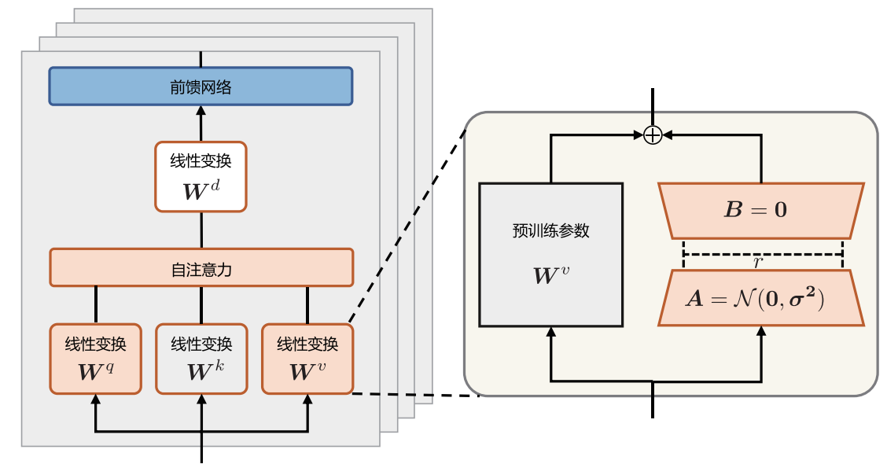
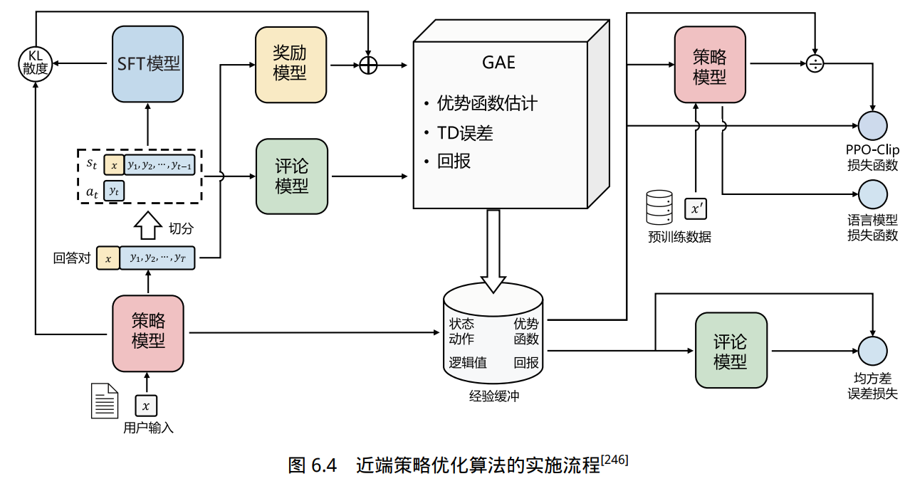

# 后训练（Post-training）（[大语言模型从理论到实践教材](https://intro-llm.github.io/chapter/LLM-TAP-v2.pdf)）
后训练包括微调、对齐和瘦身（蒸馏剪枝等）
## 监督微调（指令微调:Instructional fine-tuning，SFT:Supervised fine-tuning）（[Hugging Face Transformer实战，包括微调、低精度训练和分布式训练学习视频地址](https://www.bilibili.com/video/BV1ma4y1g791?vd_source=d3285a2ba86bc368a3901aac90d388ea&spm_id_from=333.788.videopod.sections)）
SFT是有监督微调，包括全量微调和部分参数微调，PEFT是部分参数微调，也叫作参数高效微调，LORA是PEFT中的一种，还有很多变体  

经过海量数据预训练后的语言模型虽然具备了大量的“知识”，但是由于其训练时的目标仅是进行下一个词的预测，因此不能够理解并遵循人类自然语言形式的指令。指令微调主要包括三个步骤，定义指令和输出要求、数据调整成指令与对应响应的形式、微调操作（训练方式与预训练相似，指令微调目标函数只针对输出部分计算损失）  

### 指令微调数据
文本对构成，包含指令输入（User）和答案输出（Assistant）两个部分。如果期望模型具备多轮对话的能力，可以将对话历史都作为指令，让模型学习最后一轮的输出结果（把最后一轮Assistant回答前的所有数据当做输入，最后一轮Assistant回答作为输出）。
#### 数据构建方法
手动构建、现有数据集转换、自动构建、综合模式

### 高效模型微调（PEFT，Parameter-Efficient Fine-Tuning）
参数高效微调，一类只更新极少量额外参数（而不改动原模型大部分权重）的微调方法总称。
#### LoRA（Low-Rank Adaptation）（[讲解博客地址](https://zhuanlan.zhihu.com/p/702419731)）（[实操视频地址](https://www.bilibili.com/video/BV13w411y7fq?vd_source=d3285a2ba86bc368a3901aac90d388ea&spm_id_from=333.788.videopod.sections)）
低秩适配。PEFT 中最主流的一种具体实现：在原始权重旁插入低秩矩阵，只训练这些低秩参数。

语言模型针对特定任务微调之后，权重矩阵通常具有很低的本征秩（Intrinsic Rank）。参数更新量即便投影到较小的子空间中，也不会影响学习的有效性。因此，提出固定预训练模型参数不变，在原本权重矩阵旁路添加低秩矩阵的乘积作为可训练参数，用以模拟参数的变化量。具体来说，假设预训练权重为 $\mathbf{W}_0 \in \mathbb{R}^{d \times k}$，可训练参数为 $\Delta\mathbf{W} = \mathbf{B}\mathbf{A}$，其中 $\mathbf{B} \in \mathbb{R}^{d \times r}$，$\mathbf{A} \in \mathbb{R}^{r \times d}$。初始化时，矩阵 $\mathbf{A}$ 通过高斯函数初始化，矩阵 $\mathbf{B}$ 为零初始化，使得训练开始之前旁路对原模型不造成影响，即参数变化量为 0。对于该权重的输入 $\mathbf{x}$ 来说，输出如下：

$$
\mathbf{h} = \mathbf{W}_0 \mathbf{x} + \Delta\mathbf{W} \mathbf{x} = \mathbf{W}_0 \mathbf{x} + \mathbf{B}\mathbf{A}\mathbf{x} \tag{5.7}
$$

#### LoRA的变体
1. LoRA (Low-Rank Adaptation)  
    思想：假设微调过程中的权重更新量（ΔW）是“低秩”（low-rank）的，可以用两个小矩阵的乘积来高效近似。

    公式详解：对于一个预训练权重矩阵 W₀，其前向传播变为 h = W₀x + BAx，其中 B 和 A 是新增的可训练小矩阵。

    秩r的选择：r 是核心超参数，用于控制“插件”的表达能力与参数量。r=4 适用于简单任务，r=16 或 r=32 则用于更复杂的语义学习。

    优势：训练参数量仅为全量微调的 0.1%-1%，训练后新增的 BA 权重可直接合并回 W₀，推理零延迟。

2. QLoRA (Quantized LoRA)  
    思想：先用一种“高保真压缩”算法（量化）让庞大的主模型“瘦身”，然后在它上面应用标准的LoRA微调。

    三大关键技术：
    - 4-bit NormalFloat (NF4) 量化。
    - 双重量化。
    - 分页优化器。
    - 优势：将模型显存占用降低 4-8 倍，让资源有限的研究者也能微调数百亿参数的大模型。

3. AdaLoRA (Adaptive LoRA)  
    思想：动态调整核心超参数 rank，在最需要的地方分配更多“专家”，在不太重要的地方则分配较少。

    原理：引入基于 SVD 的权重分解 W = W₀ + PΛQ，并配合 重要性评分 机制来动态修剪和恢复 Λ 矩阵中的奇异值。

    优势：在相同参数预算下，能实现比标准 LoRA 更好的性能。

4. Adapter Tuning (适配器微调)  
    思想：在模型结构中插入轻量级的“适配器模块”（Adapter Module）。瓶颈结构：先降维再升维；插入位置（串行/并行）和激活函数均可选。

    原理：适配器通常采用“瓶颈（bottleneck）”结构：先通过降维投影将输入压缩，经过非线性变换，再通过升维投影恢复原始维度。数学形式为 $y = f(W_{down}·(f(W_{up}·x + b_{up}))) + x$。

    优势：模块化设计使得一个模型可以拥有多个任务特定的适配器，任务切换时只需更换适配器，避免了存储多个完整模型副本的开销。

5. P-Tuning  
    思想：为输入添加可学习的“软提示”（Soft Prompt），将下游任务统一建模为“语言模型任务”。

    演变：v1（在 embedding 层后插入连续可学习的 prompt 向量） vs v2（在每层 Transformer 都添加可学习的 prompt 向量）

    优势：P-Tuning v2 微调参数量仅为全参的 0.1%-3%，同时解决了在小模型上性能不佳的问题。

6. Prefix-Tuning  
    思想：在每一层 Transformer 的 Key 和 Value 序列前，都拼接一个可学习的、任务特定的“虚拟前缀”（Virtual Prefix）。训练时只更新这些前缀参数。

    优势：通过直接干预每一层的注意力计算来调控模型行为，引导效果更直接。结合 MLP 重参数化，可更好地保持训练稳定性。

### 模型上下文窗口扩展
为了更好地满足长文本需求，有必要探索如何扩展现有的大语言模型，使其能够有效地处理更大范围的上下文信息。具体来说，扩展语言模型的长文本建模能力主要有以下方法。
- 增加上下文窗口的微调：采用直接的方式，即通过使用一个更大的上下文窗口来微调现有的预训练 Transformer，以适应长文本建模需求。
- 位置编码：改进的位置编码，如 ALiBi、LeX等能够实现一定程度上的长度外推。这意味着它们可以在小的上下文窗口上进行训练，在大的上下文窗口上进行推理。
- 插值法：将超出上下文窗口的位置编码通过插值法压缩到预训练的上下文窗口中。

## 强化学习
当前大语言模型中的强化学习技术主要沿着两个方向演进：其一是基于人类反馈的强化学习RLHF，通过奖励模型对生成文本进行整体质量评估，使模型能自主探索更优的回复策略，并使得模型回复与人类偏好和价值观对齐。典型如 ChatGPT 等对话系统，通过人类偏好数据训练奖励模型，结合近端策略优化（Proximal Policy Optimization，PPO）算法实现对齐优化。其二是面向深度推理的强化学习框架，以 OpenAI 的 O 系列模型和 DeepSeek的 R 系列为代表，通过答案校验引导模型进行多步推理。这类方法将复杂问题分解为长思维链（Chain-of-Thought）的决策序列，在数学证明、代码生成等场景中展现出超越监督学习的推理能力。两类方法都强调对生成文本的整体质量把控，前者侧重人类价值对齐，后者专注复杂问题求解，共同构成大语言模型能力进化的核心驱动力。

### 基于人类反馈的强化学习流程（RLHF）
基于人类反馈的强化学习主要分为奖励模型训练和近端策略优化两个步骤。  

奖励模型通常采用基于 Transformer 结构的预训练语言模型。在奖励模型中，移除最后一个非
嵌入层，并在最终的 Transformer 层上叠加一个额外的线性层。无论输入的是何种文本，奖励模型
都能为文本序列中的最后一个标记分配一个标量奖励值，样本质量越好，奖励值越大。  

近端策略优化设计以下四个模型：
1. 策略模型（Policy Model），生成模型回复。
2. 奖励模型（Reward Model），输出奖励分数来评估回复质量的好坏。
3. 评论模型（Critic Model），预测回复的好坏，可以在训练过程中实时调整模型，选择对未来累积收益最大的行为。
4. 参考模型（Reference Model），提供了一个 SFT 模型的备份，使模型不会出现过于极端的变化。

#### PPO（近端策略优化，Proximal Policy Optimization）
里面有一个clip裁剪，将重要性采样比率（r = π_new / π_old）压制在一个安全范围  
通常需要加载4个模型：Actor, Critic, Reward, Reference（Actor 和 Critic 是需要参数优化的）
[学习视频地址](https://www.bilibili.com/video/BV1Qy6nB5Emw?spm_id_from=333.788.videopod.sections&vd_source=d3285a2ba86bc368a3901aac90d388ea)

#### GRPO(组内相对策略优化，Group Relative Policy Optimization)
核心思想：消除对Critic模型和复杂优势函数估计的依赖，通过对同一提示的多个采样回答进行组内归一化，来充当优势函数的基线。  
无需Critic模型，通常需要加载3个模型：Policy (Actor), Reward, Reference（只优化Actor）
[学习视频地址](https://www.bilibili.com/video/BV18U6nBrE2t?spm_id_from=333.788.videopod.sections&vd_source=d3285a2ba86bc368a3901aac90d388ea)

#### GSPO（组序列策略优化，Group Sequence Policy Optimization）
GRPO的问题，在大规模训练或处理长逻辑链（Long-CoT）时，它极易导致模型性能突然衰退甚至完全崩塌，即模型崩溃（Model Collapse）。根本原因在于GRPO 奖励与优化的粒度不匹配。
将优化粒度从GRPO的Token级提升到Sequence（序列）级，从而在大规模、长序列和MoE模型的训练中实现了更稳定、更高效的性能。序列级（Sequence-level）重要性采样，序列级裁剪（Sequence-level Clipping）
[学习视频地址](https://www.bilibili.com/video/BV1KL9tBsEYU/?spm_id_fr om=333.337.search-card.all.click&vd_source=d3285a2ba86bc368a3901aac90d388ea)

#### DPO（Direct Preference Optimization）
它的训练数据不再是“回答-分数”，而是简单的“输入-好的输出-差的输出”三元组。DPO 基于 Bradley-Terry 模型，将偏好转化为概率比较问题。其损失函数 L_DPO(θ) 的目标是最大化好回答的概率，同时最小化坏回答的概率，并利用参考模型进行约束  
需要维护两个模型：Actor 和  Reference
[学习视频地址](https://www.bilibili.com/video/BV18U6nBrEus?spm_id_from=333.788.videopod.sections&vd_source=d3285a2ba86bc368a3901aac90d388ea)

