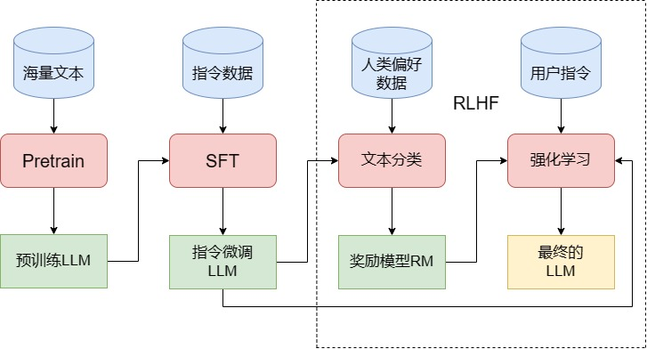
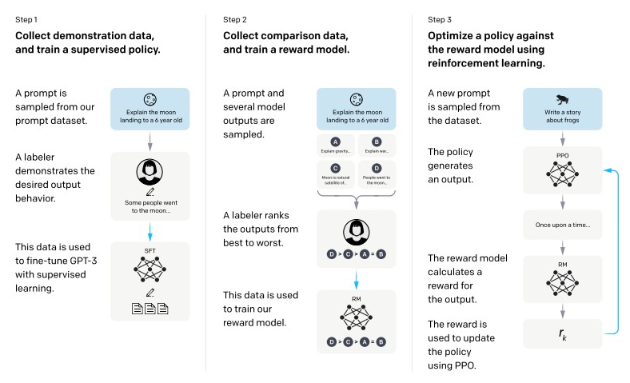
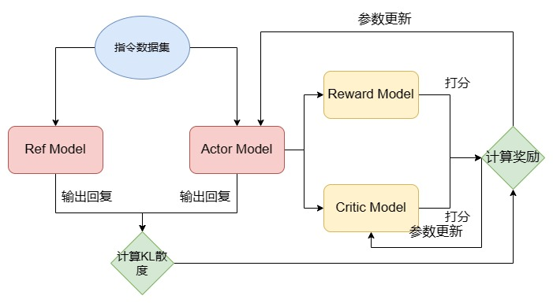

# 知识点框架
## 大模型从0到1的完整链路
- 【基座准备】预训练（Pre-training）→ 得到通用基座模型（如Llama 3、Qwen、GPT-3基座）
- 【能力对齐】后训练（Post-training）→ 把通用基座变成「可用、听话、安全」的模型
    - 第一阶段：SFT（有监督微调）→ 也叫「微调」的核心环节
        - 技术手段：全参数微调、LoRA/QLoRA（轻量化微调）
    - 第二阶段：对齐（Alignment）→ 让模型符合人类意图、安全无害
        - 基础依赖：RL（强化学习）
        - 主流方法：PPO → DPO → GRPO/DSPO（从旧到新、从复杂到简单）
- 【架构优化】模型架构/轻量化方案
    - MoE（混合专家模型）：大模型低成本扩容方案
    - 小模型架构：端侧部署、轻量化
- 【效率工具】一站式开发工具
    - LlamaFactory：大模型微调/对齐一站式工具，覆盖上面所有训练环节（覆盖SFT、DPO、PPO、LoRA/QLoRA等主流方案，快速跑通完整的微调/对齐流程）
- 【落地应用】把模型变成可解决实际问题的产品
    - RAG（检索增强生成）：解决模型幻觉、知识过时问题
    - Agent（智能体）：让模型自主调用工具、完成复杂任务

- 训练LLM的三个阶段


- SFT。模型的多轮对话能力完全来自SFT阶段，与预训练是没有关系的。接大多数LLM使用下列多轮对话的形式来进行SFT（即直接要求模型预测每一轮对话的输出）：
```
 input=<prompt_1><completion_1><prompt_2><completion_2><prompt_3><completion_3>
 output=[MASK]<completion_1>[MASK]<completion_2>[MASK]<completion_3>
```

三个阶段分别是SFT、RM和PPO，后面两个阶段是RLHF


|阶段	|名称	|做什么	|产出|
| ----- | ----- | ----- | ----- |
|Step 1	|监督微调 (SFT)	|用人工标注的 (prompt, 理想回答) 数据对预训练模型做有监督学习。	|一个初步能回答指令的模型（SFT 模型）。|
|Step 2	|训练奖励模型 (RM)	|让模型对同一个 prompt 生成多个回答；标注员对这些回答从好到坏排序；用这些排序数据训练一个奖励模型，它能给任意回答打分。	|一个能评价回答质量的奖励模型。|
|Step 3	|强化学习 (PPO)	|用 SFT 模型作为初始策略，针对奖励模型给出的分数，使用 PPO 算法进一步优化模型参数。	|最终的对齐模型（如 ChatGPT）。|

- RLHF。从功能上出发，可以将 LLM 的训练过程分成预训练与对齐（alignment）两个阶段。预训练的核心作用是赋予模型海量的知识，而所谓对齐，其实就是让模型与人类价值观一致，从而输出人类希望其输出的内容。在这个过程中，SFT 是让 LLM 和人类的指令对齐，从而具有指令遵循能力；而 RLHF 则是从更深层次令 LLM 和人类价值观对齐，令其达到安全、有用、无害的核心标准。分为训练RM和PPO训练。


- PPO（Proximal Policy Optimization，近端策略优化算法）。在具体 PPO 训练过程中，会存在四个模型。两个 LLM 和两个 RM。两个 LLM 分别是进行微调、参数更新的 actor model 和不进行参数更新的 ref model，均是从 SFT 之后的 LLM 初始化的。两个 RM 分别是进行参数更新的 critic model 和不进行参数更新的 reward model，均是从上一步训练的 RM 初始化的。
- DPO。也有学者从监督学习的思路出发，提出了 DPO（Direct Preference Optimization，直接偏好优化），可以低门槛平替 RLHF。核心思路是，将 RLHF 的强化学习问题转化为监督学习来直接学习人类偏好。DPO 通过使用奖励函数和最优策略间的映射，展示了约束奖励最大化问题完全可以通过单阶段策略训练进行优化，也就是说，通过学习 DPO 所提出的优化目标，可以直接学习人类偏好，而无需再训练 RM 以及进行强化学习。由于直接使用监督学习进行训练，DPO 只需要两个 LLM 即可完成训练，且训练过程相较 PPO 简单很多，是 RLHF 更简单易用的平替版本。


## 辨析
- MiniMind：大模型全流程教学型项目，主打「从零到一训练小模型」，所有核心代码基于 PyTorch 原生从零实现，无第三方黑盒封装。让开发者亲手造一个完整的小 GPT，彻底搞懂大模型从数据处理、预训练、SFT、LoRA、DPO 对齐的全链路底层原理，打破大模型的黑盒
- LlamaFactory：工业级大模型微调 / 对齐一站式工具，主打「低代码快速落地」，封装了所有主流微调、对齐算法，支持上百种开源基座，开箱即用。让开发者不用写底层代码，快速完成私有模型微调、效果优化，直接落地业务场景，是大模型微调的事实标准工具
- GPT架构和LlaMA架构（[一文看懂](https://blog.csdn.net/2401_84205765/article/details/142328006)和[架构对比](https://zhuanlan.zhihu.com/p/1903528209556943043)）

# 博客好文推荐
- [Infy AI](https://www.infyai.cn/)
    - [搞清楚 BatchNorm、LayerNorm、RMSNorm 到底在干嘛](https://www.infyai.cn/2025/12/26/normalization-notes/)
    - [现代大语言模型的架构细节：从 RMSNorm 到 Loss 计算](https://www.infyai.cn/2026/04/27/llm-architecture-details/)


# 手撕
- [手撕Attention](https://www.xiaohongshu.com/explore/69ad304c000000002202302a)
- [手撕 BatchNorm 和 LayerNorm](https://jasaxion.github.io/posts/2025/02/llm-%E9%9D%A2%E8%AF%95%E6%89%8B%E6%92%95-batchnorm-%E5%92%8C-layernorm/)